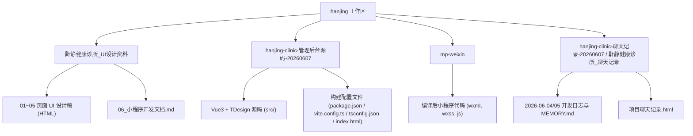

# 鼾静健康诊所项目（Hanjing Health Clinic Project）

该项目是为 **“鼾静健康诊所”**（专注于睡眠呼吸障碍/打鼾/OSAS的定制式可调舌型阻鼾器数字化诊所）开发的完整数字化系统。包含微信小程序端（C端）与管理后台（B端）。

---

## 1. 项目架构



---

## 2. 各端代码路径、解释与结构

### 2.1 微信小程序端 (C端患者 & 推广员) [🚀 已包含编译后包]

*   **代码路径**：📁 **[mp-weixin](./mp-weixin)** (编译后小程序端代码)
*   **端解释**：该目录为 `uni-app` 编译后的微信小程序产物。包含了患者预约、睡眠评估（ESS量表 + AI鼾声分析）、治疗追踪（阻鼾器佩戴记录、调节日志、睡眠趋势图表）、产品商城、个人中心、二级分销中心等功能。
*   **如何运行/预览**：
    1.  打开 **微信开发者工具**。
    2.  导入项目，选择目录为工作区根目录下的 `mp-weixin` 文件夹。
    3.  AppID 自动识别为 `wx0155dae3603ed54b`，即可在微信开发者工具中直接运行、调试与上传体验版。

---

### 2.2 管理后台端 (B端诊所运营 & 医生) [🚀 已重构并完成页面完善]

*   **代码路径**：📁 **[hanjing-clinic-管理后台源码-20260607](./hanjing-clinic-管理后台源码-20260607)**
*   **端解释**：基于 `Vue 3` + `TypeScript` + `TDesign Web` 构建的诊所管理后台，专供诊所管理人员、门店客服和主治医生使用。用于接收小程序的预约订单、录入就诊病历、进行医生排班配置、审批分销商提现、审核社区帖子以及基础系统设置。
*   **重构与完善工作（已完成）**：
    1.  **修复路径结构**：将原 Windows 扁平解压重命名格式（如 `src\App.vue` 等）全部还原为规范的 Unix 嵌套目录结构。
    2.  **补全构建配置**：补充了缺失的构建环境配置文件（`package.json`, `vite.config.ts`, `tsconfig.json`, `index.html`, `.gitignore`）并成功拉取依赖。
    3.  **覆盖主题色**：修改了 **[src/styles/global.css](./hanjing-clinic-管理后台源码-20260607/src/styles/global.css)**，覆盖 TDesign 组件库变量为品牌专属的 **“舒眠蓝 (#3B6BF5)”** 与 状态/指标色 **“安宁绿 (#1A9D5C)”**。
    4.  **优化侧边栏结构**：重构了 **[src/App.vue](./hanjing-clinic-管理后台源码-20260607/src/App.vue)** 侧边栏，将全部功能按钮进行“基础管理”、“营销与交易”及“系统管理”的分组展示，并引入新菜单。
    5.  **补齐一级页面**：
        *   **[提现审核页](./hanjing-clinic-管理后台源码-20260607/src/views/distribution/withdraw.vue)**：展示分销商提现单据列表，提供弹窗审核通过/驳回录入原因等业务逻辑。
        *   **[操作日志页](./hanjing-clinic-管理后台源码-20260607/src/views/settings/log.vue)**：呈现系统全局管理员审计追踪日志表。
    6.  **补齐核心二级页面**：
        *   **[患者详情页](./hanjing-clinic-管理后台源码-20260607/src/views/patient/detail.vue)**：集成 ECharts 动态曲线图，展示患者设备佩戴时长及 AHI 指标关联趋势，提供病历时间线与就诊/消费历史详情 Tab。
        *   **[订单详情页](./hanjing-clinic-管理后台源码-20260607/src/views/order/detail.vue)**：展示订单明细、价格组成、分销佣金及物流录入弹窗。
        *   **[医生排班页](./hanjing-clinic-管理后台源码-20260607/src/views/doctor/schedule.vue)**：周排班周历网格展示与弹窗编辑。
        *   **[新建预约页](./hanjing-clinic-管理后台源码-20260607/src/views/appointment/create.vue)**：前台手动挂号、查询患者或快捷建档表单。
        *   **[预约详情页](./hanjing-clinic-管理后台源码-20260607/src/views/appointment/detail.vue)**：提供到诊一键签到及病情主诉展示。
    7.  **安全鉴权控制**：
        *   **[登录页](./hanjing-clinic-管理后台源码-20260607/src/views/login/index.vue)**：支持账号密码与短信验证码双登录方式。
        *   **[路由导航守卫](./hanjing-clinic-管理后台源码-20260607/src/router/index.ts)**：引入了 `beforeEach` 守卫进行 Local Token 校验，拦截未登录访问并强制重定向。
*   **重构后的代码结构**：
    ```text
    hanjing-clinic-管理后台源码-20260607/
    ├── node_modules/        # 项目依赖库
    ├── dist/                # 编译打包输出目录 (已打包成功)
    ├── package.json         # 声明 Vue3/Pinia/TDesign/ECharts 依赖及构建命令
    ├── vite.config.ts       # 配置 Vite 构建工具与 @ 别名解析
    ├── tsconfig.json        # TypeScript 编译选项及路径别名声明
    ├── index.html           # 页面访问入口
    ├── .gitignore           # Git 忽略配置文件
    └── src/                 # 核心源码目录
        ├── App.vue          # 管理后台主布局模板
        ├── main.ts          # 程序入口文件 (挂载 Pinia, TDesign, router 路由)
        ├── router/
        │   └── index.ts     # 路由注册表 (含 beforeEach 路由鉴权守卫)
        ├── styles/
        │   └── global.css   # 全局基础重置样式 (含 TDesign 品牌色变量覆盖)
        └── views/           # 页面视图组件 (数据及交互目前由 Mock 驱动)
            ├── login/       # 登录组件页
            ├── dashboard/   # 数据看板 (使用 ECharts 绘制统计图表)
            ├── appointment/ # 预约管理 (含新建预约 create.vue / 预约详情 detail.vue)
            ├── patient/     # 患者档案管理 (含患者详情页 detail.vue)
            ├── doctor/      # 医生管理 (含排班管理周历 schedule.vue)
            ├── store/       # 门店管理
            ├── order/       # 订单管理 (含订单详情页 detail.vue)
            ├── distribution/# 分销商与提现管理 (含提现审核 withdraw.vue)
            ├── content/     # 社区内容审核
            └── settings/    # 系统基础配置 (含审计日志操作 log.vue)
    ```

---

## 3. 本地运行与构建指南

由于管理后台已成功整理并补全了配置文件，您可以在本地直接运行或打包该项目：

### 1) 本地开发启动
在本地终端进入管理后台目录，并启动 Vite 本地开发服务器：
```bash
cd hanjing-clinic-管理后台源码-20260607
npm run dev
```
启动后可在浏览器中直接访问本地服务（默认端口为 `3000`，如未登录将自动拦截跳转至 `/login` 页，可点击“立即登录”进行体验）。

### 2) 生产环境打包
打包生成生产环境静态资源文件：
```bash
cd hanjing-clinic-管理后台源码-20260607
npm run build
```
打包产物将输出在 `dist/` 目录中，可直接用于 Nginx 静态托管部署。

---

## 4. 生产级别标准下的后续优化方向

在**生产级别（Production-grade）**的交付标准下，项目仍存在以下架构与安全等层面的问题，需要在后续迭代中着重解决：

### 4.1 架构与数据流问题
1.  **假数据强行硬编码在视图层**：
    *   **问题**：目前所有模块的数据均为前端硬编码在对应的 `.vue` 页面组件内，没有真正的接口调用和网络层。
    *   **改进**：必须将数据与视图层分离。建议在 `src/` 下建立统一的 API 层（`src/api/`），使用封装好的 Axios / Fetch 模块统一管理网络请求。
2.  **状态管理 (Pinia) 未落到实处**：
    *   **问题**：尽管注册了 Pinia，但并没有在 stores 目录中定义任何全局状态。
    *   **改进**：需提取登录状态、当前用户资料、所选门店、通知消息等全局状态到 Store 中。

### 4.2 安全与权限控制隐患
1.  **没有角色权限控制 (RBAC)**：
    *   **问题**：诊所前台、主治医生、超级管理员在系统中的可见菜单和操作权限没有区分，页面展示完全一样。
    *   **改进**：后台必须基于 RBAC 权限设计，根据用户角色动态下发并渲染菜单。

### 4.3 敏感数据处理与合规性
1.  **医疗敏感数据明文风险**：
    *   **问题**：该项目为医疗类系统，涉及患者病史、主诉、身份证等敏感信息。目前的数据均为明文，存在严重的隐私合规风险。
    *   **改进**：需要遵循**国家等保二级/三级**规范。对于身份证、联系电话等信息，前端须配合后端进行动态遮蔽脱敏传输，并在本地加密存储敏感数据。
