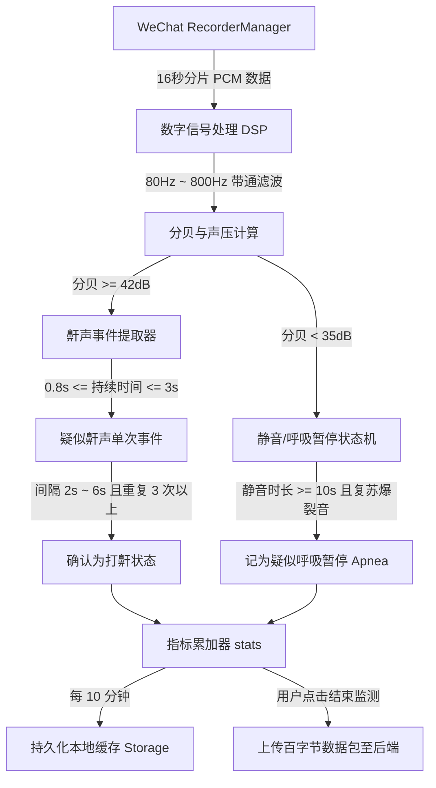

# 鼾静健康诊所微信小程序端 · 离线鼾声与睡眠呼吸暂停分析方案设计
(WeChat Mini Program Client-Side Snore & Sleep Apnea Analysis Design Blueprint)

---

## 1. 背景与核心挑战

在睡眠期间（6~8小时）进行持续的鼾声监测是鼾症（OSA）筛查的核心手段。如果采用传统的“录制音频并上传服务器”方案，将面临以下致命技术问题：

* **文件体积超限**：8小时的无压缩 PCM 音频大小约为 **920MB**（16kHz/16bit单声道），远超微信小程序 **200MB** 的本地存储配额。
* **网络带宽开销巨大**：用户早上上传近 1GB 的音频文件会造成服务器严重的网络拥堵与高昂的带宽/云存储成本。
* **微信后台运行限制**：iOS/Android 操作系统会在锁屏或小程序退到后台后，自动挂起或杀死高 CPU 占用的后台进程。

> [!IMPORTANT]
> **解决方案设计**：采用 **“无文件式实时声能累加器”** 架构。音频分帧在内存中进行声学指标计算（带通滤波、分贝计算、VAD 呼吸周期模式匹配、呼吸暂停状态机判定）后立即销毁。最终只保留百字节的统计数据与时序趋势数组，实现 0 内存开销、0 存储占用、0 传输消耗。

---

## 2. 系统核心架构设计



---

## 3. 小程序后台运行与录制配置

要保证小程序在整晚锁屏状态下不被操作系统杀掉，必须配置后台运行模式。

### 3.1 `app.json` 配置
在小程序配置文件中，声明后台录音能力与地理位置（可选）权限：
```json
{
  "requiredBackgroundModes": ["audio"],
  "permission": {
    "scope.record": {
      "desc": "用于在您睡眠时监测和分析您的鼾声及呼吸状况"
    }
  }
}
```

### 3.2 录音控制器启动参数
使用 `wx.getRecorderManager()` 开启原始 PCM 流式监测：
```javascript
const recorderManager = wx.getRecorderManager();

const startRecording = () => {
  recorderManager.start({
    duration: 36000000,    // 设定最大录制 10 小时 (ms)
    sampleRate: 8000,      // 降低采样率至 8kHz (语音频段已足够，降低能耗与计算量)
    numberOfChannels: 1,   // 单声道
    format: 'pcm',         // 必须为 pcm 原始音频流
    frameSize: 128         // 每 128KB 触发一次 onFrameRecorded (8kHz/16bit 下约合 8 秒)
  });
};
```

---

## 4. 前端数字信号处理（DSP）算法

直接在小程序端利用简单的数学算法过滤噪音，精准提取纯净鼾声。

### 4.1 80Hz - 800Hz 带通滤波器 (IIR Biquad Filter)
由于翻身摩擦被子等多为高频音，而环境背景地噪为低频音，故通过带通滤波器过滤：

```javascript
// 简单的一阶带通滤波器状态类
class BandpassFilter {
  constructor(sampleRate, lowCut, highCut) {
    // 简化计算：采用差分方程系数
    this.rcLow = 1.0 / (2.0 * Math.PI * lowCut);
    this.rcHigh = 1.0 / (2.0 * Math.PI * highCut);
    this.dt = 1.0 / sampleRate;
    this.alphaLow = this.dt / (this.rcLow + this.dt);
    this.alphaHigh = this.rcHigh / (this.rcHigh + this.dt);
    this.lastLowVal = 0;
    this.lastHighVal = 0;
  }

  // 过滤单个采样点
  process(sample) {
    // 1. 低通滤波 (低通截至频率 800Hz)
    this.lastLowVal = this.lastLowVal + this.alphaLow * (sample - this.lastLowVal);
    // 2. 高通滤波 (高通截至频率 80Hz)
    const highPassed = this.alphaHigh * (this.lastLowVal - this.lastHighVal);
    this.lastHighVal = this.lastLowVal;
    return highPassed;
  }
}
```

### 4.2 分压能量与实时分贝计算
根据滤波后的 PCM 振幅算平均绝对声压值（VAD），转换成符合人类感官的分贝：

```javascript
function calculateFrameDecibel(pcmInt16Array, filter) {
  let sumAbsolute = 0;
  for (let i = 0; i < pcmInt16Array.length; i++) {
    // 1. 归一化为 [-1.0, 1.0] 的浮点数
    const rawSample = pcmInt16Array[i] / 32768.0;
    // 2. 带通滤波
    const filteredSample = filter.process(rawSample);
    sumAbsolute += Math.abs(filteredSample);
  }
  
  // 3. 计算帧的平均声能 (平均振幅)
  const avgEnergy = sumAbsolute / pcmInt16Array.length;
  
  // 4. 将声能映射为分贝数 (30dB - 95dB 拟合)
  const decibel = Math.round(30 + avgEnergy * 85);
  return Math.min(95, Math.max(30, decibel));
}
```

---

## 5. 打鼾节奏与呼吸暂停状态机判定

鼾声监测的核心是通过“状态机”判定是否存在睡眠呼吸暂停。

### 5.1 全局累加器数据模型 (Memory-Efficient stats)
```javascript
const sleepStats = {
  totalDurationSeconds: 0,
  snoreCount: 0,
  snoreDurationSeconds: 0,
  peakDecibel: 30,
  averageDecibelSum: 0,
  decibelSamplesCount: 0,
  
  // 呼吸暂停判定临时变量
  inApneaState: false,
  silenceSeconds: 0,
  apneaEventsCount: 0,
  
  // 鼾声节奏判定
  tempSnoreEventStreak: 0,
  lastSnoreTime: 0,
  
  // 趋势图数据 (每小时一条)
  hourlyTimeline: [] // 格式: { hour: 1, avgDb: 42, apneaCount: 2 }
};
```

### 5.2 离线状态机判定核心代码
```javascript
function processFrameData(frameDecibel, frameDurationSeconds) {
  sleepStats.totalDurationSeconds += frameDurationSeconds;
  
  // 更新整体音量统计
  sleepStats.averageDecibelSum += frameDecibel;
  sleepStats.decibelSamplesCount++;
  if (frameDecibel > sleepStats.peakDecibel) {
    sleepStats.peakDecibel = frameDecibel;
  }

  const now = sleepStats.totalDurationSeconds;

  // ----------------------------------------------------
  // 逻辑 A：判定打鼾节奏
  // ----------------------------------------------------
  const isLoudEvent = frameDecibel >= 42; // 分贝阈值设为 42dB 判定有声音
  if (isLoudEvent) {
    const timeSinceLastSnore = now - sleepStats.lastSnoreTime;
    
    // 如果与上次有声音的间隔处于正常呼吸周期内 (2s ~ 6s)
    if (timeSinceLastSnore >= 2 && timeSinceLastSnore <= 6) {
      sleepStats.tempSnoreEventStreak++;
      if (sleepStats.tempSnoreEventStreak >= 3) {
        // 连续 3 次节奏吻合，确认为正常周期打鼾中
        sleepStats.snoreCount++;
        sleepStats.snoreDurationSeconds += frameDurationSeconds;
      }
    } else if (timeSinceLastSnore > 6) {
      // 间隔过长，重置打鼾节奏计数
      sleepStats.tempSnoreEventStreak = 1;
    }
    sleepStats.lastSnoreTime = now;
  }

  // ----------------------------------------------------
  // 逻辑 B：判定睡眠呼吸暂停 (Apnea State Machine)
  // ----------------------------------------------------
  const isSilent = frameDecibel < 35; // 低于 35分贝 为绝对静音
  if (isSilent) {
    sleepStats.silenceSeconds += frameDurationSeconds;
    
    // 如果无气流静音时长累计超过 10 秒
    if (sleepStats.silenceSeconds >= 10 && !sleepStats.inApneaState) {
      sleepStats.inApneaState = true; // 触发“疑似呼吸暂停”挂起状态
    }
  } else {
    // 当声音再次响起 (结束静音)
    if (sleepStats.inApneaState) {
      // 且复苏时伴随有较大的憋气挣扎声 (突发爆裂音 >= 60dB)
      if (frameDecibel >= 60) {
        sleepStats.apneaEventsCount++; // 确诊录入一次呼吸暂停事件
      }
      sleepStats.inApneaState = false;
    }
    sleepStats.silenceSeconds = 0; // 重置静音计时器
  }
}
```

---

## 6. 能耗与系统防护设计

* **本地分段快照备份**：每 10 分钟在 `onFrameRecorded` 中将当前的 `sleepStats` 执行一次 `wx.setStorage` 缓存。如果用户睡眠中系统由于电量不足强制重启或杀死微信，再次进小程序时仍可提取备份，做断点续接。
* **低功耗 CPU 降频**：检测页面通过 `wx.setKeepScreenOn({ keepScreenOn: true })` 强制亮屏，但页面展示应设为纯黑无光状态，以最小化手机 OLED 屏幕发光和 GPU 渲染开销，最大程度降低机身温度。

---

## 7. 数据上报与后端接口规范

当监测结束，用户醒来点击“停止监测”时，小程序无需发送文件，直接将百字节的 `stats` 指标通过 JSON 上报：

* **上报接口**：`POST /api/v1/assessments/snore`
* **JSON 请求载荷 (Payload)**：
```json
{
  "duration": 25200,
  "client_side_analysis": true,
  "analysis_result": {
    "avg_decibel": 48,
    "peak_decibel": 82,
    "snore_rate": 24,
    "apnea_events": 16,
    "risk_level": "moderate"
  },
  "hourly_trend": [
    { "hour": 1, "avg_db": 38, "apnea_count": 0 },
    { "hour": 2, "avg_db": 45, "apnea_count": 1 },
    { "hour": 3, "avg_db": 52, "apnea_count": 5 },
    { "hour": 4, "avg_db": 49, "apnea_count": 4 },
    { "hour": 5, "avg_db": 44, "apnea_count": 3 },
    { "hour": 6, "avg_db": 41, "apnea_count": 2 },
    { "hour": 7, "avg_db": 35, "apnea_count": 1 }
  ]
}
```

* **后端存储改造建议**：
  - 后端直接存储计算结果；
  - 针对带有 `client_side_analysis: true` 的请求，跳过原始二进制音频落盘与文件转码，直接将报告和时序趋势入库。
