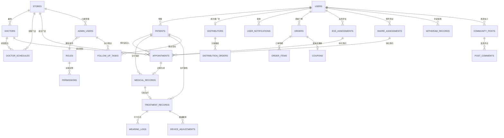

# 鼾静健康诊所 · 数据库与接口设计规范

> [!NOTE]
> 本规范结合了微信小程序客户端与管理后台（Admin Panel）的业务需求，针对用户管理、门店与预约、睡眠评估与AI鼾声分析、OSAS治疗追踪、分销返利商城以及医患社区等核心业务模块，设计了关系型数据库表结构与分类 API 接口规范。

---

## 💾 一、 数据库与数据表设计

以下设计采用关系型数据库（如 MySQL / PostgreSQL）结构，主键统一为 `BIGINT UNSIGNED AUTO_INCREMENT`，部分特定关联键除外。

### 1. 用户核心模块

#### 1.1 用户表 (`users`)
存储小程序注册 of 微信用户基本信息。
| 字段名 | 类型 | 约束 | 默认值 | 说明 |
| :--- | :--- | :--- | :--- | :--- |
| `id` | `BIGINT UNSIGNED` | `PRIMARY KEY` | AUTO_INCREMENT | 用户唯一ID |
| `openid` | `VARCHAR(64)` | `UNIQUE`, `NOT NULL` | - | 微信用户的 OpenID |
| `unionid` | `VARCHAR(64)` | `UNIQUE` | NULL | 微信开放平台 UnionID |
| `phone` | `VARCHAR(20)` | `UNIQUE` | NULL | 绑定手机号 |
| `nickname` | `VARCHAR(50)` | `NOT NULL` | - | 用户昵称 |
| `avatar_url` | `VARCHAR(255)` | - | NULL | 头像链接 |
| `gender` | `TINYINT` | - | `0` | 性别：0-未知, 1-男, 2-女 |
| `birthday` | `DATE` | - | NULL | 出生日期 |
| `member_level` | `VARCHAR(20)` | `NOT NULL` | `'normal'` | 会员等级：normal-普通, silver-白银, gold-黄金, diamond-钻石 |
| `points` | `INT` | `NOT NULL` | `0` | 会员积分 |
| `total_spent` | `INT` | `NOT NULL` | `0` | 累计消费金额（分） |
| `created_at` | `TIMESTAMP` | - | CURRENT_TIMESTAMP | 创建时间 |
| `updated_at` | `TIMESTAMP` | - | CURRENT_TIMESTAMP | 更新时间 |

#### 1.2 就诊患者/家庭成员表 (`patients`)
管理患者真实信息，支持“本人”及“家庭成员”的绑定。
| 字段名 | 类型 | 约束 | 默认值 | 说明 |
| :--- | :--- | :--- | :--- | :--- |
| `id` | `BIGINT UNSIGNED` | `PRIMARY KEY` | AUTO_INCREMENT | 患者ID |
| `user_id` | `BIGINT UNSIGNED` | `FOREIGN KEY` | `NOT NULL` | 所属主用户账户ID |
| `name` | `VARCHAR(50)` | `NOT NULL` | - | 真实姓名 |
| `relation` | `VARCHAR(20)` | `NOT NULL` | `'self'` | 关系：self-本人, spouse-配偶, child-子女, parent-父母, other-其他 |
| `gender` | `TINYINT` | - | `0` | 性别：0-未知, 1-男, 2-女 |
| `age` | `INT` | - | NULL | 年龄 |
| `phone` | `VARCHAR(20)` | - | NULL | 联系电话 |
| `has_snore` | `TINYINT(1)` | - | `0` | 是否打鼾：0-否, 1-是 |
| `created_at` | `TIMESTAMP` | - | CURRENT_TIMESTAMP | 创建时间 |
| `updated_at` | `TIMESTAMP` | - | CURRENT_TIMESTAMP | 更新时间 |

---

### 2. 门店、医生与排班模块

#### 2.1 门店表 (`stores`)
| 字段名 | 类型 | 约束 | 默认值 | 说明 |
| :--- | :--- | :--- | :--- | :--- |
| `id` | `BIGINT UNSIGNED` | `PRIMARY KEY` | AUTO_INCREMENT | 门店ID |
| `name` | `VARCHAR(100)` | `NOT NULL` | - | 门店名称 |
| `code` | `VARCHAR(30)` | `UNIQUE` | - | 门店代码（如 SZ-HQ） |
| `address` | `VARCHAR(255)` | `NOT NULL` | - | 详细地址 |
| `city` | `VARCHAR(50)` | - | - | 所在城市 |
| `district` | `VARCHAR(50)` | - | - | 所在区域 |
| `latitude` | `DECIMAL(10,7)` | - | - | 纬度 |
| `longitude` | `DECIMAL(10,7)` | - | - | 经度 |
| `phone` | `VARCHAR(30)` | - | - | 门诊电话 |
| `open_time` | `TIME` | - | `'09:00:00'` | 营业开始时间 |
| `close_time` | `TIME` | - | `'18:00:00'` | 营业结束时间 |
| `status` | `VARCHAR(20)` | `NOT NULL` | `'open'` | 状态：open-营业中, prepare-筹备中, closed-关闭 |
| `has_parking` | `TINYINT(1)` | - | `1` | 是否免费停车：0-否, 1-是 |
| `created_at` | `TIMESTAMP` | - | CURRENT_TIMESTAMP | 创建时间 |

#### 2.2 门店特色表 (`store_features`)
存储门店的服务标签。
| 字段名 | 类型 | 约束 | 说明 |
| :--- | :--- | :--- | :--- |
| `store_id` | `BIGINT UNSIGNED` | `FOREIGN KEY` | 门店ID |
| `feature` | `VARCHAR(50)` | `NOT NULL` | 服务特色（如 VIP室、睡眠监测、直播室） |

#### 2.3 医生表 (`doctors`)
| 字段名 | 类型 | 约束 | 默认值 | 说明 |
| :--- | :--- | :--- | :--- | :--- |
| `id` | `BIGINT UNSIGNED` | `PRIMARY KEY` | AUTO_INCREMENT | 医生ID |
| `name` | `VARCHAR(50)` | `NOT NULL` | - | 医生姓名 |
| `avatar_url` | `VARCHAR(255)` | - | NULL | 医生头像 |
| `title` | `VARCHAR(30)` | `NOT NULL` | - | 职称（如 主任医师、主治医师） |
| `specialty` | `VARCHAR(50)` | `NOT NULL` | - | 专科方向（如 睡眠呼吸、口腔正畸） |
| `hospital` | `VARCHAR(100)` | - | NULL | 来源公立医院背景 |
| `intro` | `TEXT` | - | - | 简介 |
| `experience_years` | `INT` | - | `0` | 临床经验年数 |
| `rating` | `DECIMAL(2,1)` | - | `5.0` | 患者评分 (0-5.0) |
| `consult_fee` | `INT` | - | `0` | 挂号/咨询费（分） |
| `status` | `TINYINT` | - | `1` | 医生状态：0-离职/禁用, 1-在职/启用 |

#### 2.4 医生门店关联表 (`doctor_store_mapping`)
记录医生多点执业的排班门店范围。
| 字段名 | 类型 | 约束 | 说明 |
| :--- | :--- | :--- | :--- |
| `doctor_id` | `BIGINT UNSIGNED` | `FOREIGN KEY` | 医生ID |
| `store_id` | `BIGINT UNSIGNED` | `FOREIGN KEY` | 执业门店ID |

#### 2.5 医生出诊排班表 (`doctor_schedules`)
| 字段名 | 类型 | 约束 | 默认值 | 说明 |
| :--- | :--- | :--- | :--- | :--- |
| `id` | `BIGINT UNSIGNED` | `PRIMARY KEY` | AUTO_INCREMENT | 排班ID |
| `doctor_id` | `BIGINT UNSIGNED` | `FOREIGN KEY` | `NOT NULL` | 医生ID |
| `store_id` | `BIGINT UNSIGNED` | `FOREIGN KEY` | `NOT NULL` | 坐诊门店ID |
| `date` | `DATE` | `NOT NULL` | - | 排班日期 |
| `period` | `VARCHAR(10)` | `NOT NULL` | - | 时段：morning-上午, afternoon-下午 |
| `start_time` | `TIME` | `NOT NULL` | - | 接诊开始时间 |
| `end_time` | `TIME` | `NOT NULL` | - | 接诊结束时间 |
| `total_slots` | `INT` | `NOT NULL` | `6` | 预设总预约号源 |
| `booked_slots` | `INT` | `NOT NULL` | `0` | 已预约号数 |
| `status` | `VARCHAR(20)` | `NOT NULL` | `'available'` | 状态：available-可约, full-约满, closed-停诊 |

---

### 3. 预约就诊模块

#### 3.1 预约记录表 (`appointments`)
| 字段名 | 类型 | 约束 | 默认值 | 说明 |
| :--- | :--- | :--- | :--- | :--- |
| `id` | `BIGINT UNSIGNED` | `PRIMARY KEY` | AUTO_INCREMENT | 预约记录ID |
| `appointment_no` | `VARCHAR(32)` | `UNIQUE`, `NOT NULL` | - | 预约号（唯一业务流水） |
| `user_id` | `BIGINT UNSIGNED` | `FOREIGN KEY` | `NOT NULL` | 发起用户ID |
| `patient_id` | `BIGINT UNSIGNED` | `FOREIGN KEY` | `NOT NULL` | 实际就诊患者ID |
| `store_id` | `BIGINT UNSIGNED` | `FOREIGN KEY` | `NOT NULL` | 就诊门店ID |
| `doctor_id` | `BIGINT UNSIGNED` | `FOREIGN KEY` | `NOT NULL` | 就诊医生ID |
| `schedule_id` | `BIGINT UNSIGNED` | `FOREIGN KEY` | `NOT NULL` | 对应出诊排班ID |
| `appointment_date` | `DATE` | `NOT NULL` | - | 预约就诊日期 |
| `appointment_time` | `VARCHAR(20)` | `NOT NULL` | - | 预约具体时段（如 09:00-09:30） |
| `type` | `VARCHAR(20)` | `NOT NULL` | `'first'` | 诊别：first-初诊, followup-复诊 |
| `status` | `VARCHAR(20)` | `NOT NULL` | `'pending'` | 状态：pending-待就诊, confirmed-已确认, arrived-已到诊, waiting-呼叫候诊, completed-已完成, cancelled-已取消 |
| `symptom_desc` | `TEXT` | - | NULL | 症状/主诉描述 |
| `cancel_reason` | `VARCHAR(255)` | - | NULL | 取消预约原因 |
| `source` | `VARCHAR(20)` | - | `'mini_app'` | 预约来源：mini_app-小程序, telephone-电话, walk_in-直接到店 |
| `ess_assessment_id` | `BIGINT UNSIGNED` | `FOREIGN KEY` | NULL | 关联的 ESS 嗜睡自测报告ID（用于医生接诊时查看初筛背景） |
| `snore_assessment_id`| `BIGINT UNSIGNED` | `FOREIGN KEY` | NULL | 关联的 AI 鼾声录音分析报告ID（用于医生接诊时查看初筛背景） |
| `created_at` | `TIMESTAMP` | - | CURRENT_TIMESTAMP | 创建时间 |
| `updated_at` | `TIMESTAMP` | - | CURRENT_TIMESTAMP | 更新时间 |

---

### 4. 睡眠评估与 AI 鼾声录音模块

#### 4.1 ESS 嗜睡量表结果表 (`ess_assessments`)
| 字段名 | 类型 | 约束 | 默认值 | 说明 |
| :--- | :--- | :--- | :--- | :--- |
| `id` | `BIGINT UNSIGNED` | `PRIMARY KEY` | AUTO_INCREMENT | 记录ID |
| `user_id` | `BIGINT UNSIGNED` | `FOREIGN KEY` | `NOT NULL` | 用户ID |
| `total_score` | `INT` | `NOT NULL` | - | ESS累计总得分 (0-24分) |
| `risk_level` | `VARCHAR(30)` | `NOT NULL` | - | 诊断等级（如 重度嗜睡, 正常偏高） |
| `answers` | `JSON` | `NOT NULL` | - | 各题作答详情：`[{"question_id": 1, "score": 2}, ...]` |
| `created_at` | `TIMESTAMP` | - | CURRENT_TIMESTAMP | 评估时间 |

#### 4.2 AI 鼾声录音评估表 (`snore_assessments`)
| 字段名 | 类型 | 约束 | 默认值 | 说明 |
| :--- | :--- | :--- | :--- | :--- |
| `id` | `BIGINT UNSIGNED` | `PRIMARY KEY` | AUTO_INCREMENT | 记录ID |
| `user_id` | `BIGINT UNSIGNED` | `FOREIGN KEY` | `NOT NULL` | 用户ID |
| `file_url` | `VARCHAR(255)` | `NOT NULL` | - | 录音音频文件存储地址 |
| `duration` | `INT` | `NOT NULL` | - | 录音总时长（秒） |
| `avg_decibel` | `INT` | `NOT NULL` | - | 平均鼾声分贝 (dB) |
| `peak_decibel` | `INT` | `NOT NULL` | - | 最高鼾声分贝 (dB) |
| `snore_rate` | `INT` | `NOT NULL` | - | 打鼾时长占比 (0-100%) |
| `apnea_events` | `INT` | `NOT NULL` | - | 监测到的疑似呼吸暂停次数 |
| `risk_level` | `VARCHAR(10)` | `NOT NULL` | `'low'` | 呼吸暂停风险度：low-低风险, medium-中风险, high-高风险 |
| `created_at` | `TIMESTAMP` | - | CURRENT_TIMESTAMP | 录制分析时间 |

---

### 5. 阻鼾治疗随访模块

#### 5.1 门诊电子病历表 (`medical_records`)
| 字段名 | 类型 | 约束 | 默认值 | 说明 |
| :--- | :--- | :--- | :--- | :--- |
| `id` | `BIGINT UNSIGNED` | `PRIMARY KEY` | AUTO_INCREMENT | 病历记录ID |
| `patient_id` | `BIGINT UNSIGNED` | `FOREIGN KEY` | `NOT NULL` | 患者ID |
| `doctor_id` | `BIGINT UNSIGNED` | `FOREIGN KEY` | `NOT NULL` | 主治医生ID |
| `store_id` | `BIGINT UNSIGNED` | `FOREIGN KEY` | `NOT NULL` | 就诊门店ID |
| `appointment_id` | `BIGINT UNSIGNED` | `FOREIGN KEY` | NULL | 对应的挂号预约ID（串联就诊挂号与实际诊疗病历） |
| `visit_date` | `DATE` | `NOT NULL` | - | 就诊日期 |
| `diagnosis` | `TEXT` | `NOT NULL` | - | 诊断意见（如 轻度OSAS，AHI 12次/小时） |
| `prescription` | `TEXT` | - | NULL | 治疗处方（如 定制HJ-MAD-03） |
| `doctor_advice` | `TEXT` | - | NULL | 医嘱/健康指引建议 |
| `note` | `TEXT` | - | NULL | 备注/回访注意 |
| `created_at` | `TIMESTAMP` | - | CURRENT_TIMESTAMP | 创建时间 |

#### 5.2 阻鼾器治疗建档主表 (`treatment_records`)
| 字段名 | 类型 | 约束 | 默认值 | 说明 |
| :--- | :--- | :--- | :--- | :--- |
| `id` | `BIGINT UNSIGNED` | `PRIMARY KEY` | AUTO_INCREMENT | 治疗档案ID |
| `patient_id` | `BIGINT UNSIGNED` | `FOREIGN KEY` | `NOT NULL` | 关联患者ID |
| `doctor_id` | `BIGINT UNSIGNED` | `FOREIGN KEY` | `NOT NULL` | 负责随访医生ID |
| `medical_record_id` | `BIGINT UNSIGNED` | `FOREIGN KEY` | NULL | 关联的诊断病历ID（追溯阻鼾器物理配戴处方的临床来源） |
| `device_model` | `VARCHAR(50)` | `NOT NULL` | - | 配戴阻鼾器型号 (如 HJ-MAD-03) |
| `initial_advancement` | `DECIMAL(3,1)` | `NOT NULL` | `0.0` | 初始下颌前移调节量 (mm) |
| `current_advancement` | `DECIMAL(3,1)` | `NOT NULL` | `0.0` | 当前下颌前移调节量 (mm) |
| `start_date` | `DATE` | `NOT NULL` | - | 初配戴/开始治疗日期 |
| `next_adjust_date` | `DATE` | - | NULL | 下次预约微调/随访日期 |
| `status` | `VARCHAR(20)` | `NOT NULL` | `'active'` | 治疗状态：active-治疗中, paused-暂停, completed-已完成结束 |
| `created_at` | `TIMESTAMP` | - | CURRENT_TIMESTAMP | 建档时间 |

#### 5.3 每日佩戴追踪打卡表 (`wearing_logs`)
| 字段名 | 类型 | 约束 | 默认值 | 说明 |
| :--- | :--- | :--- | :--- | :--- |
| `id` | `BIGINT UNSIGNED` | `PRIMARY KEY` | AUTO_INCREMENT | 记录ID |
| `treatment_id` | `BIGINT UNSIGNED` | `FOREIGN KEY` | `NOT NULL` | 关联治疗档案ID |
| `date` | `DATE` | `NOT NULL` | - | 打卡日期 |
| `wear_duration` | `DECIMAL(3,1)` | `NOT NULL` | `0.0` | 昨晚佩戴时长（小时） |
| `comfort` | `TINYINT` | `NOT NULL` | `3` | 舒适度评分 (1-5) |
| `note` | `VARCHAR(255)` | - | NULL | 佩戴感受备注（如 关节微酸） |
| `created_at` | `TIMESTAMP` | - | CURRENT_TIMESTAMP | 上传时间 |

#### 5.4 阻鼾器参数微调记录表 (`device_adjustments`)
| 字段名 | 类型 | 约束 | 默认值 | 说明 |
| :--- | :--- | :--- | :--- | :--- |
| `id` | `BIGINT UNSIGNED` | `PRIMARY KEY` | AUTO_INCREMENT | 微调记录ID |
| `treatment_id` | `BIGINT UNSIGNED` | `FOREIGN KEY` | `NOT NULL` | 关联治疗档案ID |
| `adjust_date` | `DATE` | `NOT NULL` | - | 微调操作日期 |
| `operator_id` | `BIGINT UNSIGNED` | `NOT NULL` | - | 操作人员ID (医生/技术员) |
| `adjusted_advancement` | `DECIMAL(3,1)` | `NOT NULL` | - | 变更后下颌前移量 (mm) |
| `patient_feedback` | `VARCHAR(255)` | - | NULL | 患者配戴微调后即时反馈 |
| `instructions` | `TEXT` | - | NULL | 针对微调后参数的特别医嘱 |

---

### 6. 商品商城与订单模块

#### 6.1 商品表 (`products`)
| 字段名 | 类型 | 约束 | 默认值 | 说明 |
| :--- | :--- | :--- | :--- | :--- |
| `id` | `BIGINT UNSIGNED` | `PRIMARY KEY` | AUTO_INCREMENT |商品ID |
| `name` | `VARCHAR(150)` | `NOT NULL` | - | 商品名称 |
| `category` | `VARCHAR(20)` | `NOT NULL` | - | 类别：device-阻鼾器/器械, accessory-配件耗材, service-医疗服务套餐 |
| `image_url` | `VARCHAR(255)` | `NOT NULL` | - | 主图地址 |
| `gallery_urls` | `JSON` | - | NULL | 详情轮播图列表 (JSON 数组) |
| `price` | `INT` | `NOT NULL` | - | 售价（分） |
| `original_price` | `INT` | - | NULL | 原价/划线价（分） |
| `description` | `TEXT` | - | NULL | 商品简介与描述 |
| `stock` | `INT` | `NOT NULL` | `0` | 物理库存数 |
| `sales_count` | `INT` | `NOT NULL` | `0` | 销量统计 |
| `is_distribution` | `TINYINT(1)` | - | `0` | 是否参与分销：0-否, 1-是 |
| `commission_rate` | `DECIMAL(4,2)` | - | `0.00` | 佣金比例（0.00-1.00），如 0.12 表示 12% |
| `status` | `VARCHAR(10)` | `NOT NULL` | `'off'` | 上架状态：on-上架售卖, off-下架 |
| `created_at` | `TIMESTAMP` | - | CURRENT_TIMESTAMP | 创建时间 |

#### 6.2 订单主表 (`orders`)
| 字段名 | 类型 | 约束 | 默认值 | 说明 |
| :--- | :--- | :--- | :--- | :--- |
| `id` | `BIGINT UNSIGNED` | `PRIMARY KEY` | AUTO_INCREMENT | 订单ID |
| `order_no` | `VARCHAR(32)` | `UNIQUE`, `NOT NULL` | - | 订单流水号 |
| `user_id` | `BIGINT UNSIGNED` | `FOREIGN KEY` | `NOT NULL` | 下单用户ID |
| `type` | `VARCHAR(20)` | `NOT NULL` | `'product'` | 订单类型：product-实物商品, appointment-挂号挂牌服务 |
| `total_amount` | `INT` | `NOT NULL` | - | 订单总金额（分） |
| `discount_amount` | `INT` | `NOT NULL` | `0` | 优惠券等减免金额（分） |
| `coupon_id` | `BIGINT UNSIGNED` | `FOREIGN KEY` | NULL | 所关联抵扣的优惠券ID |
| `pay_amount` | `INT` | `NOT NULL` | - | 实际支付金额（分） |
| `pay_method` | `VARCHAR(20)` | - | `'wechat'` | 支付通道：wechat-微信支付 |
| `pay_at` | `TIMESTAMP` | - | NULL | 支付时间 |
| `status` | `VARCHAR(20)` | `NOT NULL` | `'pending'` | 状态：pending-待付款, paid-已付款/待发货, shipped-已发货, completed-已完成, cancelled-已取消, refunded-已退款 |
| `shipping_address` | `JSON` | - | NULL | 收货人地址详情快照 |
| `created_at` | `TIMESTAMP` | - | CURRENT_TIMESTAMP | 订单创建时间 |
| `updated_at` | `TIMESTAMP` | - | CURRENT_TIMESTAMP | 状态更新时间 |

#### 6.3 订单明细表 (`order_items`)
| 字段名 | 类型 | 约束 | 默认值 | 说明 |
| :--- | :--- | :--- | :--- | :--- |
| `id` | `BIGINT UNSIGNED` | `PRIMARY KEY` | AUTO_INCREMENT | 明细ID |
| `order_id` | `BIGINT UNSIGNED` | `FOREIGN KEY` | `NOT NULL` | 对应订单ID |
| `product_id` | `BIGINT UNSIGNED` | `FOREIGN KEY` | `NOT NULL` | 下单时商品ID |
| `product_name` | `VARCHAR(150)` | `NOT NULL` | - | 商品名称快照 |
| `product_image` | `VARCHAR(255)` | - | - | 商品主图快照 |
| `price` | `INT` | `NOT NULL` | - | 下单时单价（分） |
| `quantity` | `INT` | `NOT NULL` | `1` | 购买数量 |

---

### 7. 二级分销推广模块

#### 7.1 推广员主表 (`distributors`)
| 字段名 | 类型 | 约束 | 默认值 | 说明 |
| :--- | :--- | :--- | :--- | :--- |
| `id` | `BIGINT UNSIGNED` | `PRIMARY KEY` | AUTO_INCREMENT | 推广员ID |
| `user_id` | `BIGINT UNSIGNED` | `FOREIGN KEY` | `NOT NULL` | 关联用户账户ID |
| `nickname` | `VARCHAR(50)` | `NOT NULL` | - | 推广展示别名 |
| `avatar_url` | `VARCHAR(255)` | - | NULL | 推广展示头像 |
| `level` | `VARCHAR(20)` | `NOT NULL` | `'silver'` | 推广等级：silver-白银, gold-黄金, diamond-钻石 |
| `invite_code` | `VARCHAR(20)` | `UNIQUE`, `NOT NULL` | - | 专属推荐邀请码 |
| `invite_qr_url` | `VARCHAR(255)` | - | NULL | 二维码海报链接 |
| `total_commission` | `INT` | `NOT NULL` | `0` | 累计赚取佣金金额（分） |
| `available_commission`| `INT` | `NOT NULL` | `0` | 余额（可提现，分） |
| `withdrawn_amount` | `INT` | `NOT NULL` | `0` | 累计已成功提现金额（分） |
| `status` | `VARCHAR(20)` | `NOT NULL` | `'active'` | 状态：active-有效, frozen-冻结封禁 |
| `created_at` | `TIMESTAMP` | - | CURRENT_TIMESTAMP | 成为推广员时间 |

#### 7.2 分销层级树状关联表 (`distribution_relationships`)
保存两级分销网上下线关系。
| 字段名 | 类型 | 约束 | 说明 |
| :--- | :--- | :--- | :--- |
| `parent_user_id` | `BIGINT UNSIGNED` | `FOREIGN KEY` | 上级推荐人（必须是推广员）的用户ID |
| `child_user_id` | `BIGINT UNSIGNED` | `FOREIGN KEY` | 下级被推荐人的用户ID |
| `level` | `TINYINT` | `NOT NULL` | 层级关系：1-直接下线（一级）, 2-间接下线（二级） |
| `created_at` | `TIMESTAMP` | - | 关联绑定时间 |

#### 7.3 分销佣金账单明细表 (`distribution_orders`)
| 字段名 | 类型 | 约束 | 默认值 | 说明 |
| :--- | :--- | :--- | :--- | :--- |
| `id` | `BIGINT UNSIGNED` | `PRIMARY KEY` | AUTO_INCREMENT | 佣金记录ID |
| `order_id` | `BIGINT UNSIGNED` | `FOREIGN KEY` | `NOT NULL` | 关联商场销售订单ID |
| `distributor_id` | `BIGINT UNSIGNED` | `FOREIGN KEY` | `NOT NULL` | 享受提成的推广员ID |
| `buyer_name` | `VARCHAR(50)` | `NOT NULL` | - | 下单买家脱敏姓名（如 李*） |
| `order_amount` | `INT` | `NOT NULL` | - | 订单成交总金额（分） |
| `commission_amount` | `INT` | `NOT NULL` | - | 该推广员分得的佣金（分） |
| `commission_level` | `TINYINT` | `NOT NULL` | `1` | 佣金判定：1-一级佣金, 2-二级团队奖励佣金 |
| `status` | `VARCHAR(20)` | `NOT NULL` | `'pending'` | 结算状态：pending-待计算冻结, settled-已确认发放到账, cancelled-退单已作废 |
| `settled_at` | `TIMESTAMP` | - | NULL | 实际发放结算入账时间 |
| `created_at` | `TIMESTAMP` | - | CURRENT_TIMESTAMP | 订单交易发生时间 |

#### 7.4 提现审批流水表 (`withdraw_records`)
| 字段名 | 类型 | 约束 | 默认值 | 说明 |
| :--- | :--- | :--- | :--- | :--- |
| `id` | `BIGINT UNSIGNED` | `PRIMARY KEY` | AUTO_INCREMENT | 提现单ID |
| `user_id` | `BIGINT UNSIGNED` | `FOREIGN KEY` | `NOT NULL` | 申请提现的用户ID |
| `amount` | `INT` | `NOT NULL` | - | 申请提现金额（分） |
| `fee` | `INT` | `NOT NULL` | `0` | 手续费扣除（分） |
| `actual_amount` | `INT` | `NOT NULL` | - | 扣除手续费后实际打款额（分） |
| `status` | `VARCHAR(20)` | `NOT NULL` | `'pending'` | 状态：pending-待初审, processing-打款处理中, success-已到账, failed-审批驳回/打款失败 |
| `account_info` | `VARCHAR(255)` | `NOT NULL` | - | 提现目的账户（如 微信零钱 / 银行卡号及开户行） |
| `completed_at` | `TIMESTAMP` | - | NULL | 确认成功打款完成时间 |
| `created_at` | `TIMESTAMP` | - | CURRENT_TIMESTAMP | 提现申请发起时间 |

---

### 8. 营销直播与社区发帖模块

#### 8.1 直播回放与预告表 (`live_rooms`)
| 字段名 | 类型 | 约束 | 默认值 | 说明 |
| :--- | :--- | :--- | :--- | :--- |
| `id` | `BIGINT UNSIGNED` | `PRIMARY KEY` | AUTO_INCREMENT | 直播间ID |
| `title` | `VARCHAR(150)` | `NOT NULL` | - | 直播标题 |
| `cover_url` | `VARCHAR(255)` | `NOT NULL` | - | 直播封面图 |
| `anchor_name` | `VARCHAR(50)` | `NOT NULL` | - | 主播/医生名称 |
| `anchor_avatar` | `VARCHAR(255)` | - | NULL | 主播头像 |
| `status` | `VARCHAR(20)` | `NOT NULL` | `'upcoming'` | 直播状态：upcoming-预告, live-直播中, replay-精彩回放 |
| `start_time` | `TIMESTAMP` | `NOT NULL` | - | 直播计划开始时间 |
| `end_time` | `TIMESTAMP` | - | NULL | 直播结束时间 |
| `viewer_count` | `INT` | `NOT NULL` | `0` | 观看或点击预约的人数统计 |
| `replay_url` | `VARCHAR(255)` | - | NULL | 视频回放点播源地址 |
| `product_ids` | `JSON` | - | NULL | 直播带货关联商品ID列表（JSON数组） |

#### 8.2 社区发帖交流表 (`community_posts`)
| 字段名 | 类型 | 约束 | 默认值 | 说明 |
| :--- | :--- | :--- | :--- | :--- |
| `id` | `BIGINT UNSIGNED` | `PRIMARY KEY` | AUTO_INCREMENT | 帖子唯一ID |
| `user_id` | `BIGINT UNSIGNED` | `FOREIGN KEY` | `NOT NULL` | 发帖人用户ID |
| `user_role` | `VARCHAR(20)` | `NOT NULL` | `'patient'` | 发表身份标识：patient-患者, doctor-医生, technician-睡眠技术专家 |
| `title` | `VARCHAR(150)` | `NOT NULL` | - | 帖子标题 |
| `content` | `TEXT` | `NOT NULL` | - | 帖子正文内容 |
| `image_urls` | `JSON` | - | NULL | 上传图片列表 (JSON 数组) |
| `tags` | `JSON` | - | NULL | 话题标签列表 (JSON 数组，如 `["阻鼾器配戴", "OSA改善"]`) |
| `likes_count` | `INT` | `NOT NULL` | `0` | 点赞总数 |
| `comments_count` | `INT` | `NOT NULL` | `0` | 回复总数 |
| `is_top` | `TINYINT(1)` | - | `0` | 是否置顶：0-普通, 1-置顶 |
| `status` | `VARCHAR(20)` | `NOT NULL` | `'pending'` | 审核状态：pending-待人工审核, approved-已发布, rejected-违规退回 |
| `created_at` | `TIMESTAMP` | - | CURRENT_TIMESTAMP | 发表时间 |
| `updated_at` | `TIMESTAMP` | - | CURRENT_TIMESTAMP | 更新时间 |

#### 8.3 帖子评论回复表 (`post_comments`)
支持单层平铺或树状二级盖楼回复。
| 字段名 | 类型 | 约束 | 默认值 | 说明 |
| :--- | :--- | :--- | :--- | :--- |
| `id` | `BIGINT UNSIGNED` | `PRIMARY KEY` | AUTO_INCREMENT | 评论ID |
| `post_id` | `BIGINT UNSIGNED` | `FOREIGN KEY` | `NOT NULL` | 主帖ID |
| `user_id` | `BIGINT UNSIGNED` | `FOREIGN KEY` | `NOT NULL` | 评论人ID |
| `parent_id` | `BIGINT UNSIGNED` | - | NULL | 回复的父评论ID（多级回复时使用） |
| `content` | `TEXT` | `NOT NULL` | - | 回复内容 |
| `likes_count` | `INT` | `NOT NULL` | `0` | 评论获得点赞数 |
| `status` | `VARCHAR(20)` | `NOT NULL` | `'approved'` | 审核状态：pending-审核中, approved-显示, rejected-屏蔽 |
| `created_at` | `TIMESTAMP` | - | CURRENT_TIMESTAMP | 回复发表时间 |

---

### 9. 管理后台、系统随访与优惠券模块

#### 9.1 后台管理员账号表 (`admin_users`)
| 字段名 | 类型 | 约束 | 默认值 | 说明 |
| :--- | :--- | :--- | :--- | :--- |
| `id` | `BIGINT UNSIGNED` | `PRIMARY KEY` | AUTO_INCREMENT | 管理员账户ID |
| `username` | `VARCHAR(50)` | `UNIQUE`, `NOT NULL` | - | 登录账号 |
| `password_hash` | `VARCHAR(255)` | `NOT NULL` | - | 密码哈希值 |
| `name` | `VARCHAR(50)` | `NOT NULL` | - | 用户姓名 |
| `phone` | `VARCHAR(20)` | - | NULL | 联系手机 |
| `role_id` | `BIGINT UNSIGNED` | `FOREIGN KEY` | `NOT NULL` | 绑定角色ID |
| `store_id` | `BIGINT UNSIGNED` | `FOREIGN KEY` | NULL | 归属管理门店ID（NULL表示管理全部门店权限） |
| `status` | `VARCHAR(20)` | `NOT NULL` | `'online'` | 在线状态/启用状态：online-启用, offline-禁用 |
| `last_login_at` | `TIMESTAMP` | - | NULL | 最近一次登录时间 |
| `created_at` | `TIMESTAMP` | - | CURRENT_TIMESTAMP | 创建时间 |

#### 9.2 系统角色表 (`roles`)
| 字段名 | 类型 | 约束 | 说明 |
| :--- | :--- | :--- | :--- |
| `id` | `BIGINT UNSIGNED` | `PRIMARY KEY` | 角色ID |
| `name` | `VARCHAR(50)` | `UNIQUE`, `NOT NULL` | 角色名称（如：超级管理员, 门店店长, 财务人员, 内容编辑） |
| `code` | `VARCHAR(30)` | `UNIQUE`, `NOT NULL` | 角色唯一标识代码（如：super_admin, store_mgr） |
| `created_at` | `TIMESTAMP` | - | 创建时间 |

#### 9.3 角色权限关联表 (`permissions`)
| 字段名 | 类型 | 约束 | 说明 |
| :--- | :--- | :--- | :--- |
| `role_id` | `BIGINT UNSIGNED` | `FOREIGN KEY` | 角色ID |
| `permission_resource`| `VARCHAR(100)` | `NOT NULL` | 授权的菜单或API资源标识符（如 `appointment:edit`, `withdraw:approve`） |

#### 9.4 医护随访任务表 (`follow_up_tasks`)
| 字段名 | 类型 | 约束 | 默认值 | 说明 |
| :--- | :--- | :--- | :--- | :--- |
| `id` | `BIGINT UNSIGNED` | `PRIMARY KEY` | AUTO_INCREMENT | 任务ID |
| `patient_id` | `BIGINT UNSIGNED` | `FOREIGN KEY` | `NOT NULL` | 随访患者ID |
| `doctor_id` | `BIGINT UNSIGNED` | `FOREIGN KEY` | `NOT NULL` | 责任医护/执行人ID |
| `plan_date` | `DATE` | `NOT NULL` | - | 计划随访执行日期 |
| `type` | `VARCHAR(20)` | `NOT NULL` | `'phone'` | 随访方式：phone-电话随访, chat-微信在线沟通, clinic-门诊面诊 |
| `status` | `VARCHAR(20)` | `NOT NULL` | `'pending'` | 任务状态：pending-待随访, processing-随访中, completed-已完成, expired-超时未随访 |
| `feedback_content` | `TEXT` | - | NULL | 随访记录总结与患者配戴主诉反馈 |
| `completed_at` | `TIMESTAMP` | - | NULL | 随访实际执行完成时间 |
| `created_at` | `TIMESTAMP` | - | CURRENT_TIMESTAMP | 任务分配建单时间 |

#### 9.5 营销优惠券表 (`coupons`)
| 字段名 | 类型 | 约束 | 默认值 | 说明 |
| :--- | :--- | :--- | :--- | :--- |
| `id` | `BIGINT UNSIGNED` | `PRIMARY KEY` | AUTO_INCREMENT | 优惠券ID |
| `title` | `VARCHAR(100)` | `NOT NULL` | - | 优惠券标题（如：618全场满减券） |
| `type` | `VARCHAR(20)` | `NOT NULL` | `'full_reduction'` | 折扣类型：full_reduction-满减券, discount-打折券 |
| `min_spend` | `INT` | `NOT NULL` | `0` | 起用门槛金额（分，0表示无门槛） |
| `discount_value` | `INT` | `NOT NULL` | - | 满减面额（分）或折扣比例（如 90 代表 9 折） |
| `start_time` | `TIMESTAMP` | `NOT NULL` | - | 优惠有效起始时间 |
| `end_time` | `TIMESTAMP` | `NOT NULL` | - | 优惠截止时间 |
| `stock` | `INT` | `NOT NULL` | `100` | 允许领取的剩余券数 |

#### 9.6 用户系统通知与订阅消息表 (`user_notifications`)
| 字段名 | 类型 | 约束 | 默认值 | 说明 |
| :--- | :--- | :--- | :--- | :--- |
| `id` | `BIGINT UNSIGNED` | `PRIMARY KEY` | AUTO_INCREMENT | 通知ID |
| `user_id` | `BIGINT UNSIGNED` | `FOREIGN KEY` | `NOT NULL` | 目标用户账户ID |
| `type` | `VARCHAR(20)` | `NOT NULL` | `'system'` | 通知类别：system-系统公告, appointment-就诊预约提醒, order-商城发货订单提醒, treatment-配戴随访提醒 |
| `title` | `VARCHAR(100)` | `NOT NULL` | - | 消息标题 |
| `content` | `TEXT` | `NOT NULL` | - | 消息正文 |
| `is_read` | `TINYINT(1)` | - | `0` | 状态：0-未读, 1-已读 |
| `payload` | `JSON` | - | NULL | 携带的关联跳转配置（如 `{ "type": "order", "id": 102 }`） |
| `created_at` | `TIMESTAMP` | - | CURRENT_TIMESTAMP | 通知发送时间 |

#### 9.7 系统广告轮播图表 (`banners`)
| 字段名 | 类型 | 约束 | 默认值 | 说明 |
| :--- | :--- | :--- | :--- | :--- |
| `id` | `BIGINT UNSIGNED` | `PRIMARY KEY` | AUTO_INCREMENT | 轮播图ID |
| `image_url` | `VARCHAR(255)` | `NOT NULL` | - | 图片网络地址 |
| `link_url` | `VARCHAR(255)` | - | NULL | 关联的小程序跳转路径 (如 `pages/live/playback/index?id=2`) |
| `sort_order` | `INT` | `NOT NULL` | `0` | 轮播切换排序权重（值小靠前） |
| `position` | `VARCHAR(30)` | `NOT NULL` | `'home'` | 展示位置：home-首页头图, mall-商城活动位 |
| `status` | `TINYINT` | - | `1` | 状态：0-隐藏禁用, 1-显示启用 |

---

## 🌐 二、 微信小程序端接口清单

本组接口主要面向小程序前端（C端患者/用户群体），需要进行标准的微信登录态及 JWT Bearer Token 验证。

### 1. 身份认证与就诊人接口

* **微信授权快捷登录**：`POST /api/v1/auth/wx-login`
  * 换取小程序登录 Token 凭证及创建/更新基本账户。
* **获取当前用户详细信息**：`GET /api/v1/user/profile`
* **更新用户个人资料**：`PUT /api/v1/user/profile`
* **查询就诊患者/家庭成员列表**：`GET /api/v1/patients`
* **绑定并创建新的就诊家庭成员**：`POST /api/v1/patients`
* **解绑/删除就诊家庭成员**：`DELETE /api/v1/patients/{id}`

### 2. 门店与医生预约挂号接口

* **查询服务门店列表**（定位排序与距离计算）：`GET /api/v1/stores`
* **查询特定门店的坐诊医生列表**：`GET /api/v1/stores/{storeId}/doctors`
* **查询医生的可预约日期列表**：`GET /api/v1/schedules/available-dates`
* **查询特定排班日期下的预约号源时段**：`GET /api/v1/schedules/slots`
* **提交就诊预约挂号申请**：`POST /api/v1/appointments`
* **取消就诊预约预约记录**：`POST /api/v1/appointments/{id}/cancel`
* **预约改约修改号段**：`POST /api/v1/appointments/{id}/reschedule`
* **获取当前用户的历史预约挂号记录**：`GET /api/v1/appointments`

### 3. 睡眠评估与 AI 鼾声分析接口

* **提交 ESS 嗜睡自测量表答卷**：`POST /api/v1/assessments/ess`
* **上传鼾声录音做 AI 呼吸暂停事件分析**：`POST /api/v1/assessments/snore-analyze`
* **查询个人历史睡眠/鼾声自测诊断报告**：`GET /api/v1/assessments/history`

### 4. 阻鼾器配戴与治疗追踪接口

* **获取当前患者的阻鼾器治疗建档概要**：`GET /api/v1/treatment/current`
* **每日配戴时长与舒适度打卡记录**：`POST /api/v1/treatment/checkin`
* **获取配戴依从率及舒适度折线走势图**：`GET /api/v1/treatment/wearing-summary`
* **获取周期性睡眠健康报告（同类比对与医嘱总结）**：`GET /api/v1/treatment/sleep-report`
* **获取阻鼾器治疗关联的时间线动态事件**：`GET /api/v1/treatment/timeline`

### 5. 商城购物与订单交易接口

* **获取商城可销售的商品列表**：`GET /api/v1/products`
* **获取商品规格与详情信息**：`GET /api/v1/products/{id}`
* **提交商品购物车结算订单并调用微信预支付接口**：`POST /api/v1/orders`
* **查询个人历史商城订单列表**：`GET /api/v1/orders`
* **查询特定商城订单明细**：`GET /api/v1/orders/{id}`
* **取消待付款的商城订单**：`POST /api/v1/orders/{id}/cancel`

### 6. 分销裂变与提现接口

* **获取推广员分销资格及专属裂变码海报**：`GET /api/v1/distribution/invite-info`
* **查询分销提成收益明细及累计推广订单**：`GET /api/v1/distribution/orders`
* **查询推广团下线成员结构**：`GET /api/v1/distribution/team`
* **提交佣金提现申请（微信零钱/银行卡）**：`POST /api/v1/distribution/withdraw`
* **查询提现打款历史记录**：`GET /api/v1/distribution/withdraw-records`

### 7. 直播展示与社区互动接口

* **查询科普/义诊直播间列表（含预告及精彩回放点播）**：`GET /api/v1/live/rooms`
* **查询社区论坛帖子列表（最新、热门、专家贴筛选）**：`GET /api/v1/community/posts`
* **浏览社区发帖正文及评论回复区**：`GET /api/v1/community/posts/{id}`
* **发表个人阻鼾/打鼾改善日常讨论帖子**：`POST /api/v1/community/posts`
* **在帖子内发表评论/回复他人评论**：`POST /api/v1/community/posts/{postId}/comments`

### 8. 系统通知与广告接口

* **获取主页及商城的活动轮播 Banner 广告位**：`GET /api/v1/system/banners`
* **查询用户收到的系统通知与订阅消息历史列表**：`GET /api/v1/system/notifications`
* **将系统消息/通知标记为已读**：`PUT /api/v1/system/notifications/{id}/read`

---

## 🖥️ 三、 管理后台端接口清单

本组接口专门服务于管理后台（Admin Console），由诊所前台、医生、技术员、内容运营以及系统管理员使用。访问以 `/api/v1/admin/` 开头，需要相应的后台管理角色权限（RBAC）。

### 1. 管理员登录与系统角色接口

* **后台人员账号密码登录**：`POST /api/v1/admin/auth/login`
* **获取当前登录后台管理员的资源权限路由树**：`GET /api/v1/admin/auth/routes`
* **查询系统角色及权限配置矩阵**：`GET /api/v1/admin/system/roles`
* **添加、修改及注销后台管理员账号**：`POST` / `PUT` / `DELETE /api/v1/admin/system/users`

### 2. 监控看板与运营数据接口

* **获取首页核心运营 KPI 看板指标（多维度时段过滤切换）**：`GET /api/v1/admin/dashboard/kpi`
* **获取各分店本月营收排行与接诊负荷统计报表**：`GET /api/v1/admin/dashboard/reports`
* **导出患者、订单、分销提现 Excel 数据表格**：`GET /api/v1/admin/data/export`

### 3. 门店与医生基础档案接口

* **新增、修改或关闭门店基本信息**：`POST` / `PUT` / `DELETE /api/v1/admin/stores`
* **医生档案管理与启用状态设置**：`POST` / `PUT` / `DELETE /api/v1/admin/doctors`
* **配置医生与执业门店关联执照**：`POST /api/v1/admin/doctors/bind-stores`

### 4. 门诊挂号排班与预约管理接口

* **批量复制与录入医生工作排班号源**：`POST /api/v1/admin/doctors/schedules/batch-save`
* **查询排班列表与已约满号源预警**：`GET /api/v1/admin/doctors/schedules`
* **查询全店预约挂号列表（支持门店/就诊状态过滤）**：`GET /api/v1/admin/appointments`
* **更新挂号就诊预约状态（已确认、呼叫叫号候诊、确认到诊等状态流转）**：`PUT /api/v1/admin/appointments/{id}/status`

### 5. 随访服务任务分发与执行接口

* **制定并派发出诊后随访任务单给对应医生/睡眠专家**：`POST /api/v1/admin/treatment/follow-up-tasks`
* **录入电话/微信随访患者的打卡依从性沟通总结反馈**：`PUT /api/v1/admin/treatment/follow-up-tasks/{id}/feedback`
* **查询随访人员的历史任务追踪列表**：`GET /api/v1/admin/treatment/follow-up-tasks`

### 6. 诊所病历与阻鼾参数微调接口

* **新建或更新门诊电子病历，开具阻鼾器疗程处方**：`POST` / `PUT /api/v1/admin/medical-records`
* **新建患者阻鼾治疗器械配戴建档档案**：`POST /api/v1/admin/treatment/register`
* **录入医生对阻鼾器下颌前移量（advancement mm）的实体微调刻度记录**：`POST /api/v1/admin/treatment/adjustments`

### 7. 商城订单与发货管理接口

* **商城实物商品及医疗服务卡券上架、下架及库存录入**：`POST` / `PUT` / `DELETE /api/v1/admin/products`
* **查询全网商城购物订单明细列表**：`GET /api/v1/admin/orders`
* **录入订单物流单号进行发货标记**：`POST /api/v1/admin/orders/{id}/ship`
* **审核用户的商城退款申请订单**：`POST /api/v1/admin/orders/{id}/refund-audit`

### 8. 佣金结算与提现批量审批接口

* **批量审批并下发推广员提现打款流水至微信零钱/银行卡**：`POST /api/v1/admin/withdrawals/batch-approve`
* **冻结或解封违规推广分销人员资格**：`PUT /api/v1/admin/distributors/{id}/status`
* **查询全网分销提成收益及分销账单明细汇总**：`GET /api/v1/admin/distribution/bills`

### 9. 论坛运营审核与营销广告接口

* **人工审核用户社区发帖或屏蔽违规敏感言论**：`PUT /api/v1/admin/community/posts/{id}/status`
* **执行社区热帖置顶或删除违规言论回复**：`POST /api/v1/admin/community/posts/{id}/action`
* **更新微信小程序首页活动轮播 Banner 图片广告位资源**：`POST` / `PUT` / `DELETE /api/v1/system/banners`
