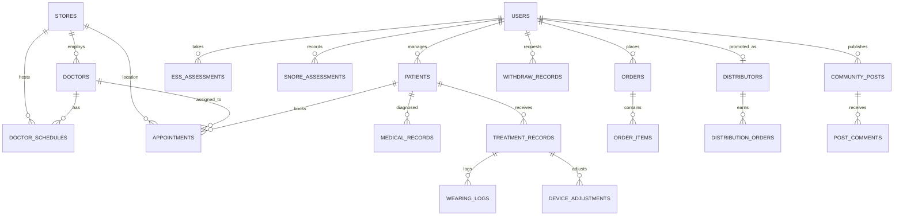

# 鼾静健康诊所 · 数据库与接口设计规范 (Database & API Design Specification)

> [!NOTE]
> 本规范结合了微信小程序客户端与管理后台（Admin Panel）的业务需求，针对用户管理、门店与预约、睡眠评估与AI鼾声分析、OSAS治疗追踪、分销返利商城以及医患社区等核心业务模块，设计了关系型数据库（如 MySQL）表结构与标准 RESTful API 接口规范。

---

## 💾 一、 数据库及数据表设计 (Database Schema Design)

以下设计采用标准关系型数据库（如 MySQL / PostgreSQL）结构，主键统一为 `BIGINT UNSIGNED AUTO_INCREMENT`，部分特定关联键（如 `UUID` 或特定字符编码）除外。



### 1. 核心用户模块 (Users & Profile)

#### 1.1 用户表 (`users`)
存储小程序注册的微信用户基本信息。
| 字段名 | 类型 | 约束 | 默认值 | 说明 |
| :--- | :--- | :--- | :--- | :--- |
| `id` | `BIGINT UNSIGNED` | `PRIMARY KEY` | AUTO_INCREMENT | 用户唯一ID |
| `openid` | `VARCHAR(64)` | `UNIQUE`, `NOT NULL` | - | 微信用户的 OpenID |
| `unionid` | `VARCHAR(64)` | `UNIQUE` | NULL | 微信开放平台 UnionID |
| `phone` | `VARCHAR(20)` | `UNIQUE` | NULL | 绑定手机号 |
| `nickname` | `VARCHAR(50)` | `NOT NULL` | - | 用户昵称 |
| `avatar_url` | `VARCHAR(255)` | - | NULL | 头像链接 |
| `gender` | `TINYINT` | - | `0` | 性别：0-未知, 1-男, 2-女 |
| `birthday` | `DATE` | - | NULL | 出生日期 |
| `member_level` | `VARCHAR(20)` | `NOT NULL` | `'normal'` | 会员等级：normal-普通, silver-白银, gold-黄金, diamond-钻石 |
| `points` | `INT` | `NOT NULL` | `0` | 会员积分 |
| `total_spent` | `INT` | `NOT NULL` | `0` | 累计消费金额（分） |
| `created_at` | `TIMESTAMP` | - | CURRENT_TIMESTAMP | 创建时间 |
| `updated_at` | `TIMESTAMP` | - | CURRENT_TIMESTAMP | 更新时间 |

#### 1.2 就诊患者/家庭成员表 (`patients`)
管理患者真实信息，支持“本人”及“家庭成员”的绑定。
| 字段名 | 类型 | 约束 | 默认值 | 说明 |
| :--- | :--- | :--- | :--- | :--- |
| `id` | `BIGINT UNSIGNED` | `PRIMARY KEY` | AUTO_INCREMENT | 患者ID |
| `user_id` | `BIGINT UNSIGNED` | `FOREIGN KEY` | `NOT NULL` | 所属主用户账户ID |
| `name` | `VARCHAR(50)` | `NOT NULL` | - | 真实姓名 |
| `relation` | `VARCHAR(20)` | `NOT NULL` | `'self'` | 关系：self-本人, spouse-配偶, child-子女, parent-父母, other-其他 |
| `gender` | `TINYINT` | - | `0` | 性别：0-未知, 1-男, 2-女 |
| `age` | `INT` | - | NULL | 年龄 |
| `phone` | `VARCHAR(20)` | - | NULL | 联系电话 |
| `has_snore` | `TINYINT(1)` | - | `0` | 是否打鼾：0-否, 1-是 |
| `created_at` | `TIMESTAMP` | - | CURRENT_TIMESTAMP | 创建时间 |
| `updated_at` | `TIMESTAMP` | - | CURRENT_TIMESTAMP | 更新时间 |

---

### 2. 门店、医生与排班模块 (Stores, Doctors & Schedules)

#### 2.1 门店表 (`stores`)
| 字段名 | 类型 | 约束 | 默认值 | 说明 |
| :--- | :--- | :--- | :--- | :--- |
| `id` | `BIGINT UNSIGNED` | `PRIMARY KEY` | AUTO_INCREMENT | 门店ID |
| `name` | `VARCHAR(100)` | `NOT NULL` | - | 门店名称 |
| `code` | `VARCHAR(30)` | `UNIQUE` | - | 门店代码（如 SZ-HQ） |
| `address` | `VARCHAR(255)` | `NOT NULL` | - | 详细地址 |
| `city` | `VARCHAR(50)` | - | - | 所在城市 |
| `district` | `VARCHAR(50)` | - | - | 所在区域 |
| `latitude` | `DECIMAL(10,7)` | - | - | 纬度 |
| `longitude` | `DECIMAL(10,7)` | - | - | 经度 |
| `phone` | `VARCHAR(30)` | - | - | 门诊电话 |
| `open_time` | `TIME` | - | `'09:00:00'` | 营业开始时间 |
| `close_time` | `TIME` | - | `'18:00:00'` | 营业结束时间 |
| `status` | `VARCHAR(20)` | `NOT NULL` | `'open'` | 状态：open-营业中, prepare-筹备中, closed-关闭 |
| `has_parking` | `TINYINT(1)` | - | `1` | 是否免费停车：0-否, 1-是 |
| `created_at` | `TIMESTAMP` | - | CURRENT_TIMESTAMP | 创建时间 |

#### 2.2 门店特色表 (`store_features`)
存储门店的服务标签。
| 字段名 | 类型 | 约束 | 说明 |
| :--- | :--- | :--- | :--- |
| `store_id` | `BIGINT UNSIGNED` | `FOREIGN KEY` | 门店ID |
| `feature` | `VARCHAR(50)` | `NOT NULL` | 服务特色（如 VIP室、睡眠监测、直播室） |

#### 2.3 医生表 (`doctors`)
| 字段名 | 类型 | 约束 | 默认值 | 说明 |
| :--- | :--- | :--- | :--- | :--- |
| `id` | `BIGINT UNSIGNED` | `PRIMARY KEY` | AUTO_INCREMENT | 医生ID |
| `name` | `VARCHAR(50)` | `NOT NULL` | - | 医生姓名 |
| `avatar_url` | `VARCHAR(255)` | - | NULL | 医生头像 |
| `title` | `VARCHAR(30)` | `NOT NULL` | - | 职称（如 主任医师、主治医师） |
| `specialty` | `VARCHAR(50)` | `NOT NULL` | - | 专科方向（如 睡眠呼吸、口腔正畸） |
| `hospital` | `VARCHAR(100)` | - | NULL | 来源公立医院背景 |
| `intro` | `TEXT` | - | - | 简介 |
| `experience_years` | `INT` | - | `0` | 临床经验年数 |
| `rating` | `DECIMAL(2,1)` | - | `5.0` | 患者评分 (0-5.0) |
| `consult_fee` | `INT` | - | `0` | 挂号/咨询费（分） |
| `status` | `TINYINT` | - | `1` | 医生状态：0-离职/禁用, 1-在职/启用 |

#### 2.4 医生门店关联表 (`doctor_store_mapping`)
记录医生多点执业的排班门店范围。
| 字段名 | 类型 | 约束 | 说明 |
| :--- | :--- | :--- | :--- |
| `doctor_id` | `BIGINT UNSIGNED` | `FOREIGN KEY` | 医生ID |
| `store_id` | `BIGINT UNSIGNED` | `FOREIGN KEY` | 执业门店ID |

#### 2.5 医生出诊排班表 (`doctor_schedules`)
| 字段名 | 类型 | 约束 | 默认值 | 说明 |
| :--- | :--- | :--- | :--- | :--- |
| `id` | `BIGINT UNSIGNED` | `PRIMARY KEY` | AUTO_INCREMENT | 排班ID |
| `doctor_id` | `BIGINT UNSIGNED` | `FOREIGN KEY` | `NOT NULL` | 医生ID |
| `store_id` | `BIGINT UNSIGNED` | `FOREIGN KEY` | `NOT NULL` | 坐诊门店ID |
| `date` | `DATE` | `NOT NULL` | - | 排班日期 |
| `period` | `VARCHAR(10)` | `NOT NULL` | - | 时段：morning-上午, afternoon-下午 |
| `start_time` | `TIME` | `NOT NULL` | - | 接诊开始时间 |
| `end_time` | `TIME` | `NOT NULL` | - | 接诊结束时间 |
| `total_slots` | `INT` | `NOT NULL` | `6` | 预设总预约号源 |
| `booked_slots` | `INT` | `NOT NULL` | `0` | 已预约号数 |
| `status` | `VARCHAR(20)` | `NOT NULL` | `'available'` | 状态：available-可约, full-约满, closed-停诊 |

---

### 3. 预约模块 (Appointments)

#### 3.1 预约记录表 (`appointments`)
| 字段名 | 类型 | 约束 | 默认值 | 说明 |
| :--- | :--- | :--- | :--- | :--- |
| `id` | `BIGINT UNSIGNED` | `PRIMARY KEY` | AUTO_INCREMENT | 预约记录ID |
| `appointment_no` | `VARCHAR(32)` | `UNIQUE`, `NOT NULL` | - | 预约号（唯一业务流水） |
| `user_id` | `BIGINT UNSIGNED` | `FOREIGN KEY` | `NOT NULL` | 发起用户ID |
| `patient_id` | `BIGINT UNSIGNED` | `FOREIGN KEY` | `NOT NULL` | 实际就诊患者ID |
| `store_id` | `BIGINT UNSIGNED` | `FOREIGN KEY` | `NOT NULL` | 就诊门店ID |
| `doctor_id` | `BIGINT UNSIGNED` | `FOREIGN KEY` | `NOT NULL` | 就诊医生ID |
| `schedule_id` | `BIGINT UNSIGNED` | `FOREIGN KEY` | `NOT NULL` | 对应出诊排班ID |
| `appointment_date` | `DATE` | `NOT NULL` | - | 预约就诊日期 |
| `appointment_time` | `VARCHAR(20)` | `NOT NULL` | - | 预约具体时段（如 09:00-09:30） |
| `type` | `VARCHAR(20)` | `NOT NULL` | `'first'` | 诊别：first-初诊, followup-复诊 |
| `status` | `VARCHAR(20)` | `NOT NULL` | `'pending'` | 状态：pending-待就诊, confirmed-已确认, arrived-已到诊, waiting-呼叫候诊, completed-已完成, cancelled-已取消 |
| `symptom_desc` | `TEXT` | - | NULL | 症状/主诉描述 |
| `cancel_reason` | `VARCHAR(255)` | - | NULL | 取消预约原因 |
| `source` | `VARCHAR(20)` | - | `'mini_app'` | 预约来源：mini_app-小程序, telephone-电话, walk_in-直接到店 |
| `created_at` | `TIMESTAMP` | - | CURRENT_TIMESTAMP | 创建时间 |
| `updated_at` | `TIMESTAMP` | - | CURRENT_TIMESTAMP | 更新时间 |

---

### 4. 睡眠评估与 AI 鼾声录制模块 (Assessments & AI Snoring)

#### 4.1 ESS 嗜睡量表结果表 (`ess_assessments`)
| 字段名 | 类型 | 约束 | 默认值 | 说明 |
| :--- | :--- | :--- | :--- | :--- |
| `id` | `BIGINT UNSIGNED` | `PRIMARY KEY` | AUTO_INCREMENT | 记录ID |
| `user_id` | `BIGINT UNSIGNED` | `FOREIGN KEY` | `NOT NULL` | 用户ID |
| `total_score` | `INT` | `NOT NULL` | - | ESS累计总得分 (0-24分) |
| `risk_level` | `VARCHAR(30)` | `NOT NULL` | - | 诊断等级（如 重度嗜睡, 正常偏高） |
| `answers` | `JSON` | `NOT NULL` | - | 各题作答详情：`[{"question_id": 1, "score": 2}, ...]` |
| `created_at` | `TIMESTAMP` | - | CURRENT_TIMESTAMP | 评估时间 |

#### 4.2 AI 鼾声录音评估表 (`snore_assessments`)
| 字段名 | 类型 | 约束 | 默认值 | 说明 |
| :--- | :--- | :--- | :--- | :--- |
| `id` | `BIGINT UNSIGNED` | `PRIMARY KEY` | AUTO_INCREMENT | 记录ID |
| `user_id` | `BIGINT UNSIGNED` | `FOREIGN KEY` | `NOT NULL` | 用户ID |
| `file_url` | `VARCHAR(255)` | `NOT NULL` | - | 录音音频文件存储地址 |
| `duration` | `INT` | `NOT NULL` | - | 录音总时长（秒） |
| `avg_decibel` | `INT` | `NOT NULL` | - | 平均鼾声分贝 (dB) |
| `peak_decibel` | `INT` | `NOT NULL` | - | 最高鼾声分贝 (dB) |
| `snore_rate` | `INT` | `NOT NULL` | - | 打鼾时长占比 (0-100%) |
| `apnea_events` | `INT` | `NOT NULL` | - | 监测到的疑似呼吸暂停次数 |
| `risk_level` | `VARCHAR(10)` | `NOT NULL` | `'low'` | 呼吸暂停风险度：low-低风险, medium-中风险, high-高风险 |
| `created_at` | `TIMESTAMP` | - | CURRENT_TIMESTAMP | 录制分析时间 |

---

### 5. OSAS 治疗追踪模块 (OSAS Treatment Tracking)

#### 5.1 门诊电子病历表 (`medical_records`)
| 字段名 | 类型 | 约束 | 默认值 | 说明 |
| :--- | :--- | :--- | :--- | :--- |
| `id` | `BIGINT UNSIGNED` | `PRIMARY KEY` | AUTO_INCREMENT | 病历记录ID |
| `patient_id` | `BIGINT UNSIGNED` | `FOREIGN KEY` | `NOT NULL` | 患者ID |
| `doctor_id` | `BIGINT UNSIGNED` | `FOREIGN KEY` | `NOT NULL` | 主治医生ID |
| `store_id` | `BIGINT UNSIGNED` | `FOREIGN KEY` | `NOT NULL` | 就诊门店ID |
| `visit_date` | `DATE` | `NOT NULL` | - | 就诊日期 |
| `diagnosis` | `TEXT` | `NOT NULL` | - | 诊断意见（如 轻度OSAS，AHI 12次/小时） |
| `prescription` | `TEXT` | - | NULL | 治疗处方（如 定制HJ-MAD-03） |
| `doctor_advice` | `TEXT` | - | NULL | 医嘱/健康指引建议 |
| `note` | `TEXT` | - | NULL | 备注/回访注意 |
| `created_at` | `TIMESTAMP` | - | CURRENT_TIMESTAMP | 创建时间 |

#### 5.2 阻鼾器治疗建档主表 (`treatment_records`)
| 字段名 | 类型 | 约束 | 默认值 | 说明 |
| :--- | :--- | :--- | :--- | :--- |
| `id` | `BIGINT UNSIGNED` | `PRIMARY KEY` | AUTO_INCREMENT | 治疗档案ID |
| `patient_id` | `BIGINT UNSIGNED` | `FOREIGN KEY` | `NOT NULL` | 关联患者ID |
| `doctor_id` | `BIGINT UNSIGNED` | `FOREIGN KEY` | `NOT NULL` | 负责随访医生ID |
| `device_model` | `VARCHAR(50)` | `NOT NULL` | - | 配戴阻鼾器型号 (如 HJ-MAD-03) |
| `initial_advancement` | `DECIMAL(3,1)` | `NOT NULL` | `0.0` | 初始下颌前移调节量 (mm) |
| `current_advancement` | `DECIMAL(3,1)` | `NOT NULL` | `0.0` | 当前下颌前移调节量 (mm) |
| `start_date` | `DATE` | `NOT NULL` | - | 初配戴/开始治疗日期 |
| `next_adjust_date` | `DATE` | - | NULL | 下次预约微调/随访日期 |
| `status` | `VARCHAR(20)` | `NOT NULL` | `'active'` | 治疗状态：active-治疗中, paused-暂停, completed-已完成结束 |
| `created_at` | `TIMESTAMP` | - | CURRENT_TIMESTAMP | 建档时间 |

#### 5.3 每日佩戴追踪打卡表 (`wearing_logs`)
| 字段名 | 类型 | 约束 | 默认值 | 说明 |
| :--- | :--- | :--- | :--- | :--- |
| `id` | `BIGINT UNSIGNED` | `PRIMARY KEY` | AUTO_INCREMENT | 记录ID |
| `treatment_id` | `BIGINT UNSIGNED` | `FOREIGN KEY` | `NOT NULL` | 关联治疗档案ID |
| `date` | `DATE` | `NOT NULL` | - | 打卡日期 |
| `wear_duration` | `DECIMAL(3,1)` | `NOT NULL` | `0.0` | 昨晚佩戴时长（小时） |
| `comfort` | `TINYINT` | `NOT NULL` | `3` | 舒适度评分 (1-5) |
| `note` | `VARCHAR(255)` | - | NULL | 佩戴感受备注（如 关节微酸） |
| `created_at` | `TIMESTAMP` | - | CURRENT_TIMESTAMP | 上传时间 |

#### 5.4 阻鼾器参数微调记录表 (`device_adjustments`)
| 字段名 | 类型 | 约束 | 默认值 | 说明 |
| :--- | :--- | :--- | :--- | :--- |
| `id` | `BIGINT UNSIGNED` | `PRIMARY KEY` | AUTO_INCREMENT | 微调记录ID |
| `treatment_id` | `BIGINT UNSIGNED` | `FOREIGN KEY` | `NOT NULL` | 关联治疗档案ID |
| `adjust_date` | `DATE` | `NOT NULL` | - | 微调操作日期 |
| `operator_id` | `BIGINT UNSIGNED` | `NOT NULL` | - | 操作人员ID (医生/技术员) |
| `adjusted_advancement` | `DECIMAL(3,1)` | `NOT NULL` | - | 变更后下颌前移量 (mm) |
| `patient_feedback` | `VARCHAR(255)` | - | NULL | 患者配戴微调后即时反馈 |
| `instructions` | `TEXT` | - | NULL | 针对微调后参数的特别医嘱 |

---

### 6. 商城与订单管理模块 (Shop & Orders)

#### 6.1 商品表 (`products`)
| 字段名 | 类型 | 约束 | 默认值 | 说明 |
| :--- | :--- | :--- | :--- | :--- |
| `id` | `BIGINT UNSIGNED` | `PRIMARY KEY` | AUTO_INCREMENT | 商品ID |
| `name` | `VARCHAR(150)` | `NOT NULL` | - | 商品名称 |
| `category` | `VARCHAR(20)` | `NOT NULL` | - | 类别：device-阻鼾器/器械, accessory-配件耗材, service-医疗服务套餐 |
| `image_url` | `VARCHAR(255)` | `NOT NULL` | - | 主图地址 |
| `gallery_urls` | `JSON` | - | NULL | 详情轮播图列表 (JSON 数组) |
| `price` | `INT` | `NOT NULL` | - | 售价（分） |
| `original_price` | `INT` | - | NULL | 原价/划线价（分） |
| `description` | `TEXT` | - | NULL | 商品简介与描述 |
| `stock` | `INT` | `NOT NULL` | `0` | 物理库存数 |
| `sales_count` | `INT` | `NOT NULL` | `0` | 销量统计 |
| `is_distribution` | `TINYINT(1)` | - | `0` | 是否参与分销：0-否, 1-是 |
| `commission_rate` | `DECIMAL(4,2)` | - | `0.00` | 佣金比例（0.00-1.00），如 0.12 表示 12% |
| `status` | `VARCHAR(10)` | `NOT NULL` | `'off'` | 上架状态：on-上架售卖, off-下架 |
| `created_at` | `TIMESTAMP` | - | CURRENT_TIMESTAMP | 创建时间 |

#### 6.2 订单主表 (`orders`)
| 字段名 | 类型 | 约束 | 默认值 | 说明 |
| :--- | :--- | :--- | :--- | :--- |
| `id` | `BIGINT UNSIGNED` | `PRIMARY KEY` | AUTO_INCREMENT | 订单ID |
| `order_no` | `VARCHAR(32)` | `UNIQUE`, `NOT NULL` | - | 订单流水号 |
| `user_id` | `BIGINT UNSIGNED` | `FOREIGN KEY` | `NOT NULL` | 下单用户ID |
| `type` | `VARCHAR(20)` | `NOT NULL` | `'product'` | 订单类型：product-实物商品, appointment-挂号挂牌服务 |
| `total_amount` | `INT` | `NOT NULL` | - | 订单总金额（分） |
| `discount_amount` | `INT` | `NOT NULL` | `0` | 优惠券等减免金额（分） |
| `pay_amount` | `INT` | `NOT NULL` | - | 实际支付金额（分） |
| `pay_method` | `VARCHAR(20)` | - | `'wechat'` | 支付通道：wechat-微信支付 |
| `pay_at` | `TIMESTAMP` | - | NULL | 支付时间 |
| `status` | `VARCHAR(20)` | `NOT NULL` | `'pending'` | 状态：pending-待付款, paid-已付款/待发货, shipped-已发货, completed-已完成, cancelled-已取消, refunded-已退款 |
| `shipping_address` | `JSON` | - | NULL | 收货人地址详情快照 |
| `created_at` | `TIMESTAMP` | - | CURRENT_TIMESTAMP | 订单创建时间 |
| `updated_at` | `TIMESTAMP` | - | CURRENT_TIMESTAMP | 状态更新时间 |

#### 6.3 订单明细表 (`order_items`)
| 字段名 | 类型 | 约束 | 默认值 | 说明 |
| :--- | :--- | :--- | :--- | :--- |
| `id` | `BIGINT UNSIGNED` | `PRIMARY KEY` | AUTO_INCREMENT | 明细ID |
| `order_id` | `BIGINT UNSIGNED` | `FOREIGN KEY` | `NOT NULL` | 对应订单ID |
| `product_id` | `BIGINT UNSIGNED` | `FOREIGN KEY` | `NOT NULL` | 下单时商品ID |
| `product_name` | `VARCHAR(150)` | `NOT NULL` | - | 商品名称快照 |
| `product_image` | `VARCHAR(255)` | - | - | 商品主图快照 |
| `price` | `INT` | `NOT NULL` | - | 下单时单价（分） |
| `quantity` | `INT` | `NOT NULL` | `1` | 购买数量 |

---

### 7. 二级分销返利模块 (Distribution & Commission)

#### 7.1 推广员主表 (`distributors`)
| 字段名 | 类型 | 约束 | 默认值 | 说明 |
| :--- | :--- | :--- | :--- | :--- |
| `id` | `BIGINT UNSIGNED` | `PRIMARY KEY` | AUTO_INCREMENT | 推广员ID |
| `user_id` | `BIGINT UNSIGNED` | `FOREIGN KEY` | `NOT NULL` | 关联用户账户ID |
| `nickname` | `VARCHAR(50)` | `NOT NULL` | - | 推广展示别名 |
| `avatar_url` | `VARCHAR(255)` | - | NULL | 推广展示头像 |
| `level` | `VARCHAR(20)` | `NOT NULL` | `'silver'` | 推广等级：silver-白银, gold-黄金, diamond-钻石 |
| `invite_code` | `VARCHAR(20)` | `UNIQUE`, `NOT NULL` | - | 专属推荐邀请码 |
| `invite_qr_url` | `VARCHAR(255)` | - | NULL | 二维码海报链接 |
| `total_commission` | `INT` | `NOT NULL` | `0` | 累计赚取佣金金额（分） |
| `available_commission`| `INT` | `NOT NULL` | `0` | 余额（可提现，分） |
| `withdrawn_amount` | `INT` | `NOT NULL` | `0` | 累计已成功提现金额（分） |
| `status` | `VARCHAR(20)` | `NOT NULL` | `'active'` | 状态：active-有效, frozen-冻结封禁 |
| `created_at` | `TIMESTAMP` | - | CURRENT_TIMESTAMP | 成为推广员时间 |

#### 7.2 分销层级树状关联表 (`distribution_relationships`)
保存两级分销网上下线关系。
| 字段名 | 类型 | 约束 | 说明 |
| :--- | :--- | :--- | :--- |
| `parent_user_id` | `BIGINT UNSIGNED` | `FOREIGN KEY` | 上级推荐人（必须是推广员）的用户ID |
| `child_user_id` | `BIGINT UNSIGNED` | `FOREIGN KEY` | 下级被推荐人的用户ID |
| `level` | `TINYINT` | `NOT NULL` | 层级关系：1-直接下线（一级）, 2-间接下线（二级） |
| `created_at` | `TIMESTAMP` | - | 关联绑定时间 |

#### 7.3 分销佣金账单明细表 (`distribution_orders`)
| 字段名 | 类型 | 约束 | 默认值 | 说明 |
| :--- | :--- | :--- | :--- | :--- |
| `id` | `BIGINT UNSIGNED` | `PRIMARY KEY` | AUTO_INCREMENT | 佣金记录ID |
| `order_id` | `BIGINT UNSIGNED` | `FOREIGN KEY` | `NOT NULL` | 关联商场销售订单ID |
| `distributor_id` | `BIGINT UNSIGNED` | `FOREIGN KEY` | `NOT NULL` | 享受提成的推广员ID |
| `buyer_name` | `VARCHAR(50)` | `NOT NULL` | - | 下单买家脱敏姓名（如 李*） |
| `order_amount` | `INT` | `NOT NULL` | - | 订单成交总金额（分） |
| `commission_amount` | `INT` | `NOT NULL` | - | 该推广员分得的佣金（分） |
| `commission_level` | `TINYINT` | `NOT NULL` | `1` | 佣金判定：1-一级佣金, 2-二级团队奖励佣金 |
| `status` | `VARCHAR(20)` | `NOT NULL` | `'pending'` | 结算状态：pending-待计算冻结, settled-已确认发放到账, cancelled-退单已作废 |
| `settled_at` | `TIMESTAMP` | - | NULL | 实际发放结算入账时间 |
| `created_at` | `TIMESTAMP` | - | CURRENT_TIMESTAMP | 订单交易发生时间 |

#### 7.4 提现审批流水表 (`withdraw_records`)
| 字段名 | 类型 | 约束 | 默认值 | 说明 |
| :--- | :--- | :--- | :--- | :--- |
| `id` | `BIGINT UNSIGNED` | `PRIMARY KEY` | AUTO_INCREMENT | 提现单ID |
| `user_id` | `BIGINT UNSIGNED` | `FOREIGN KEY` | `NOT NULL` | 申请提现的用户ID |
| `amount` | `INT` | `NOT NULL` | - | 申请提现金额（分） |
| `fee` | `INT` | `NOT NULL` | `0` | 手续费扣除（分） |
| `actual_amount` | `INT` | `NOT NULL` | - | 扣除手续费后实际打款额（分） |
| `status` | `VARCHAR(20)` | `NOT NULL` | `'pending'` | 状态：pending-待初审, processing-打款处理中, success-已到账, failed-审批驳回/打款失败 |
| `account_info` | `VARCHAR(255)` | `NOT NULL` | - | 提现目的账户（如 微信零钱 / 银行卡号及开户行） |
| `completed_at` | `TIMESTAMP` | - | NULL | 确认成功打款完成时间 |
| `created_at` | `TIMESTAMP` | - | CURRENT_TIMESTAMP | 提现申请发起时间 |

---

### 8. 内容营销与社区论坛模块 (Marketing, Live & Forum)

#### 8.1 直播回放与预告表 (`live_rooms`)
| 字段名 | 类型 | 约束 | 默认值 | 说明 |
| :--- | :--- | :--- | :--- | :--- |
| `id` | `BIGINT UNSIGNED` | `PRIMARY KEY` | AUTO_INCREMENT | 直播间ID |
| `title` | `VARCHAR(150)` | `NOT NULL` | - | 直播标题 |
| `cover_url` | `VARCHAR(255)` | `NOT NULL` | - | 直播封面图 |
| `anchor_name` | `VARCHAR(50)` | `NOT NULL` | - | 主播/医生名称 |
| `anchor_avatar` | `VARCHAR(255)` | - | NULL | 主播头像 |
| `status` | `VARCHAR(20)` | `NOT NULL` | `'upcoming'` | 直播状态：upcoming-预告, live-直播中, replay-精彩回放 |
| `start_time` | `TIMESTAMP` | `NOT NULL` | - | 直播计划开始时间 |
| `end_time` | `TIMESTAMP` | - | NULL | 直播结束时间 |
| `viewer_count` | `INT` | `NOT NULL` | `0` | 观看或点击预约的人数统计 |
| `replay_url` | `VARCHAR(255)` | - | NULL | 视频回放点播源地址 |
| `product_ids` | `JSON` | - | NULL | 直播带货关联商品ID列表（JSON数组） |

#### 8.2 社区发帖交流表 (`community_posts`)
| 字段名 | 类型 | 约束 | 默认值 | 说明 |
| :--- | :--- | :--- | :--- | :--- |
| `id` | `BIGINT UNSIGNED` | `PRIMARY KEY` | AUTO_INCREMENT | 帖子唯一ID |
| `user_id` | `BIGINT UNSIGNED` | `FOREIGN KEY` | `NOT NULL` | 发帖人用户ID |
| `user_role` | `VARCHAR(20)` | `NOT NULL` | `'patient'` | 发表身份标识：patient-患者, doctor-医生, technician-睡眠技术专家 |
| `title` | `VARCHAR(150)` | `NOT NULL` | - | 帖子标题 |
| `content` | `TEXT` | `NOT NULL` | - | 帖子正文内容 |
| `image_urls` | `JSON` | - | NULL | 上传图片列表 (JSON 数组) |
| `tags` | `JSON` | - | NULL | 话题标签列表 (JSON 数组，如 `["阻鼾器配戴", "OSA改善"]`) |
| `likes_count` | `INT` | `NOT NULL` | `0` | 点赞总数 |
| `comments_count` | `INT` | `NOT NULL` | `0` | 回复总数 |
| `is_top` | `TINYINT(1)` | - | `0` | 是否置顶：0-普通, 1-置顶 |
| `status` | `VARCHAR(20)` | `NOT NULL` | `'pending'` | 审核状态：pending-待人工审核, approved-已发布, rejected-违规退回 |
| `created_at` | `TIMESTAMP` | - | CURRENT_TIMESTAMP | 发表时间 |
| `updated_at` | `TIMESTAMP` | - | CURRENT_TIMESTAMP | 更新时间 |

#### 8.3 帖子评论回复表 (`post_comments`)
支持单层平铺或树状二级盖楼回复。
| 字段名 | 类型 | 约束 | 默认值 | 说明 |
| :--- | :--- | :--- | :--- | :--- |
| `id` | `BIGINT UNSIGNED` | `PRIMARY KEY` | AUTO_INCREMENT | 评论ID |
| `post_id` | `BIGINT UNSIGNED` | `FOREIGN KEY` | `NOT NULL` | 主帖ID |
| `user_id` | `BIGINT UNSIGNED` | `FOREIGN KEY` | `NOT NULL` | 评论人ID |
| `parent_id` | `BIGINT UNSIGNED` | - | NULL | 回复的父评论ID（多级回复时使用） |
| `content` | `TEXT` | `NOT NULL` | - | 回复内容 |
| `likes_count` | `INT` | `NOT NULL` | `0` | 评论获得点赞数 |
| `status` | `VARCHAR(20)` | `NOT NULL` | `'approved'` | 审核状态：pending-审核中, approved-显示, rejected-屏蔽 |
| `created_at` | `TIMESTAMP` | - | CURRENT_TIMESTAMP | 回复发表时间 |

---

## 🌐 二、 核心 RESTful API 接口设计 (RESTful API Design)

后端接口交互默认请求头带上授权凭证：`Authorization: Bearer <JWT_TOKEN>`。数据返回体采用统一 JSON 格式：
```json
{
  "code": 200,      // 业务状态码：200-成功，401-身份过期，403-权限不足，404-资源不存在，500-系统异常
  "message": "success",
  "data": {}        // 返回的实体对象、列表或统计信息
}
```

### 1. 认证与基本信息模块 (Authentication & User Profile)

#### 1.1 微信授权一键登录 (微信小程序端)
* **接口地址**：`POST /api/v1/auth/wx-login`
* **接口说明**：小程序通过 `wx.login` 获取 code 发送给后端换取 Token 与个人基本信息。
* **请求体**：
  ```json
  {
    "code": "061xyz123...",
    "nickname": "张先生",      // 授权头像与昵称 (可选)
    "avatarUrl": "https://thirdwx.qlogo.cn/..."
  }
  ```
* **返回数据**：
  ```json
  {
    "code": 200,
    "message": "success",
    "data": {
      "access_token": "eyJhbGciOiJIUzI1NiIsIn...",
      "refresh_token": "r_189237198a...",
      "expires_in": 7200,
      "user": {
        "id": 1,
        "nickname": "张先生",
        "avatar": "/static/demo/avatar.jpg",
        "phone": "138****8888",
        "memberLevel": "gold",
        "isDistributor": false
      }
    }
  }
  ```

#### 1.2 获取或更新个人基本资料
* **接口地址**：`GET /api/v1/user/profile` | `PUT /api/v1/user/profile`
* **请求体 (PUT)**：
  ```json
  {
    "nickname": "张小帅",
    "gender": 1,
    "birthday": "1995-06-15"
  }
  ```

#### 1.3 就诊人/家庭成员管理列表 (多就诊人架构)
* **接口地址**：`GET /api/v1/patients` | `POST /api/v1/patients` | `DELETE /api/v1/patients/{id}`
* **请求体 (POST 新建就诊人)**：
  ```json
  {
    "name": "李丽",
    "relation": "spouse",
    "gender": 2,
    "age": 34,
    "phone": "13888885678",
    "hasSnore": true
  }
  ```

---

### 2. 预约挂号服务模块 (Appointments Booking)

#### 2.1 查询门店列表 (支持定位距离排序)
* **接口地址**：`GET /api/v1/stores`
* **查询参数**：`lat` (纬度), `lng` (经度), `city` (筛选城市), `search` (搜索名称关键字)
* **返回数据**：
  ```json
  {
    "code": 200,
    "data": [
      {
        "id": 1,
        "name": "鼾静健康·南山旗舰中心",
        "address": "深圳市南山区科兴科学园...",
        "phone": "0755-88886666",
        "distance": "1.2km", // 经纬度计算出的距离
        "tags": ["旗舰店", "免费停车", "地铁直达"]
      }
    ]
  }
  ```

#### 2.2 查询对应门店的可出诊医生列表
* **接口地址**：`GET /api/v1/stores/{storeId}/doctors`
* **返回数据**：医生数组，包括姓名、头像、职称、好评率、已接诊数、出诊科室。

#### 2.3 获取医生可预约的日期区间号源
* **接口地址**：`GET /api/v1/schedules/available-dates`
* **查询参数**：`doctorId` (医生ID), `storeId` (执业门店ID)
* **返回数据**：`["2026-06-12", "2026-06-13", "2026-06-15"]`

#### 2.4 查询选定日期下的预约时段明细 (分号源号段)
* **接口地址**：`GET /api/v1/schedules/slots`
* **查询参数**：`doctorId`, `storeId`, `date`
* **返回数据**：
  ```json
  {
    "code": 200,
    "data": [
      { "id": "slot-001", "startTime": "09:00", "endTime": "09:30", "status": "available" },
      { "id": "slot-002", "startTime": "09:30", "endTime": "10:00", "status": "booked" }
    ]
  }
  ```

#### 2.5 提交预约订单
* **接口地址**：`POST /api/v1/appointments`
* **请求体**：
  ```json
  {
    "patientId": 2,
    "storeId": 1,
    "doctorId": 3,
    "scheduleId": 12,
    "appointmentDate": "2026-06-12",
    "appointmentTime": "09:00-09:30",
    "type": "first",
    "symptomDesc": "长期夜间憋醒打鼾"
  }
  ```

#### 2.6 取消或修改(改约)预约记录
* **接口地址**：`POST /api/v1/appointments/{id}/cancel` | `POST /api/v1/appointments/{id}/reschedule`
* **请求体 (Cancel)**：`{ "reason": "计划有变" }`
* **请求体 (Reschedule)**：`{ "newScheduleId": 13, "newTime": "10:00-10:30" }`

---

### 3. 睡眠自测与 AI 鼾声分析模块 (Sleep Assessments & AI)

#### 3.1 提交 ESS 嗜睡量表测试答案
* **接口地址**：`POST /api/v1/assessments/ess`
* **请求体**：
  ```json
  {
    "answers": [3, 2, 0, 1, 3, 2, 2, 1] // 8题得分数组 (0-3分)
  }
  ```
* **返回数据**：本次测试得分、划分风险区间（如：中度嗜睡倾向）、诊断指引和建议。

#### 3.2 上传鼾声录音进行 AI 自动诊断
* **接口地址**：`POST /api/v1/assessments/snore-analyze`
* **请求体**：采用 `multipart/form-data` 传输音频原文件（如 `.m4a` / `.wav`）。
* **返回数据**：
  ```json
  {
    "code": 200,
    "data": {
      "assessmentId": 128,
      "avgDecibel": 54,
      "peakDecibel": 78,
      "snoreRate": 45,
      "apneaEvents": 5,
      "riskLevel": "medium",
      "riskInfo": {
        "title": "中风险",
        "color": "#F59E0B",
        "desc": "检测到中度鼾声和少量呼吸暂停事件...",
        "tips": ["尽快预约门诊", "记录夜间醒来次数"]
      }
    }
  }
  ```

#### 3.3 获取历史睡眠测评档案记录 (量表+鼾声)
* **接口地址**：`GET /api/v1/assessments/history`
* **查询参数**：`page`, `pageSize`

---

### 4. OSAS 疗效随访与治疗追踪模块 (OSAS Treatment Progress)

#### 4.1 获取当前的治疗进度/配戴器械大纲
* **接口地址**：`GET /api/v1/treatment/current`
* **返回数据**：
  ```json
  {
    "code": 200,
    "data": {
      "treatmentId": 4,
      "patientName": "张先生",
      "deviceModel": "HJ-MAD-03",
      "doctorName": "王芳",
      "currentAdvancement": 3.0, // 当前下颌前移调整毫米数
      "startDate": "2026-05-30",
      "nextAdjustDate": "2026-06-12",
      "complianceRate": 85.7 // 依从率达标情况
    }
  }
  ```

#### 4.2 每日配戴打卡签到 (WeChat 端录入)
* **接口地址**：`POST /api/v1/treatment/checkin`
* **请求体**：
  ```json
  {
    "treatmentId": 4,
    "wearDuration": 6.5,  // 佩戴时长（小时）
    "comfort": 4,         // 1-5舒适度
    "note": "清晨起来牙齿无酸痛，比较习惯"
  }
  ```

#### 4.3 获取历史配戴打卡及舒适度折线图趋势
* **接口地址**：`GET /api/v1/treatment/wearing-summary`
* **查询参数**：`days` (最近多少天趋势，可选 7 / 30)
* **返回数据**：包含每日实际打卡时长、平均舒适度变化曲线。

#### 4.4 睡眠大健康报告
* **接口地址**：`GET /api/v1/treatment/sleep-report`
* **返回数据**：包括打卡依从率达标判定、打鼾改善情况、医生诊断总结、下次复查预约提醒。

---

### 5. 商城、分销及提现模块 (Mall, Referral & Withdraw)

#### 5.1 获取商品列表与分类筛选
* **接口地址**：`GET /api/v1/products`
* **查询参数**：`category` (筛选分类：device/accessory/service), `page`, `pageSize`

#### 5.2 提交购买订单 (商场下单)
* **接口地址**：`POST /api/v1/orders`
* **请求体**：
  ```json
  {
    "items": [
      { "productId": 1, "quantity": 1 },
      { "productId": 2, "quantity": 2 }
    ],
    "addressId": 5  // 送货地址ID
  }
  ```
* **返回数据**：
  ```json
  {
    "code": 200,
    "data": {
      "orderId": 230912,
      "orderNo": "OR20260611003",
      "payAmount": 305800,  // 需要支付 3058.00 元
      "paySignData": {      // 直接调用微信支付 wx.requestPayment 所需的签名串
        "timeStamp": "1618...",
        "nonceStr": "e65...",
        "package": "prepay_id=...",
        "signType": "MD5",
        "paySign": "..."
      }
    }
  }
  ```

#### 5.3 推广员（分销商）获取专属裂变海报与邀请码
* **接口地址**：`GET /api/v1/distribution/invite-info`
* **返回数据**：包含邀请码 `SH2026ZS001` 与用于生成海报的个人小程序码 [qrcode.png](file:///Users/apple/Desktop/WorkSpace/hanjing/mp-weixin/static/demo/qrcode.png)。

#### 5.4 查询推广分销佣金报表与推广订单明细
* **接口地址**：`GET /api/v1/distribution/orders`
* **查询参数**：`status` (筛选：settled/pending/cancelled), `page`

#### 5.5 提交提现申请
* **接口地址**：`POST /api/v1/distribution/withdraw`
* **请求体**：
  ```json
  {
    "amount": 10000,          // 提现金额 100.00 元（分）
    "accountType": "wechat",   // wechat-微信钱包，bank-银行卡
    "accountInfo": "微信绑定的实名账户..."
  }
  ```

---

### 6. 医患互动社区交流模块 (Community Forum)

#### 6.1 获取社区帖子列表 (支持热门/最新/专家筛选)
* **接口地址**：`GET /api/v1/community/posts`
* **查询参数**：`filter` (筛选：hot-热门, latest-最新, expert-认证专家贴), `page`, `pageSize`

#### 6.2 浏览帖子详情与多级评论楼层
* **接口地址**：`GET /api/v1/community/posts/{id}`
* **返回数据**：帖子详情、发帖医患档案、评论数组。

#### 6.3 发表新讨论帖子
* **接口地址**：`POST /api/v1/community/posts`
* **请求体**：
  ```json
  {
    "title": "配戴阻鼾器2周经验分享",
    "content": "刚开始确实有异物感，但是通过调整前移刻度感觉好多了...",
    "imageUrls": ["/static/product/hj-mad-03.png"],
    "tags": ["阻鼾器配戴", "经验交流"]
  }
  ```

---

## 🖥️ 三、 管理后台专属高级 API 接口 (Admin Console Exclusive APIs)

管理后台通过特权账户 Token 执行大屏监控和全量实体修改，默认路由路径以 `/api/v1/admin/` 为前缀。

### 1. 监控看板核心指标 API
* **接口地址**：`GET /api/v1/admin/dashboard/kpi`
* **查询参数**：`timeRange` (时间范围：today-今日, week-本周, month-本月)
* **返回数据**：
  ```json
  {
    "code": 200,
    "data": {
      "appointmentsCount": 156,      // 挂号预约数
      "revenue": 38600000,           // 营业营收金额
      "newPatients": 2847,           // 建档患者数
      "attendanceRate": 92.3,        // 到诊率
      "distributionCommission": 1285000,// 产生佣金
      "liveViewers": 5577            // 直播观看数
    }
  }
  ```

### 2. 医生出诊排班管理 API (批量复制与保存)
* **接口地址**：`POST /api/v1/admin/doctors/schedules/batch-save`
* **请求体**：
  ```json
  {
    "doctorId": 3,
    "storeId": 1,
    "schedules": [
      { "date": "2026-06-15", "period": "morning", "totalSlots": 6 },
      { "date": "2026-06-15", "period": "afternoon", "totalSlots": 6 }
    ]
  }
  ```

### 3. 提现申请批量审核打卡 API
* **接口地址**：`POST /api/v1/admin/withdrawals/batch-approve`
* **请求体**：
  ```json
  {
    "withdrawIds": [102, 103, 105],
    "action": "approve", // approve-通过打款, reject-拒绝驳回
    "reason": "批量初审放行"
  }
  ```

### 4. 门店运营状况多维报表查询
* **接口地址**：`GET /api/v1/admin/stores/{id}/report`
* **返回数据**：门店多月预约走势折线图、接诊医生业务贡献度饼图、本月营收与高增产品类目数据。
