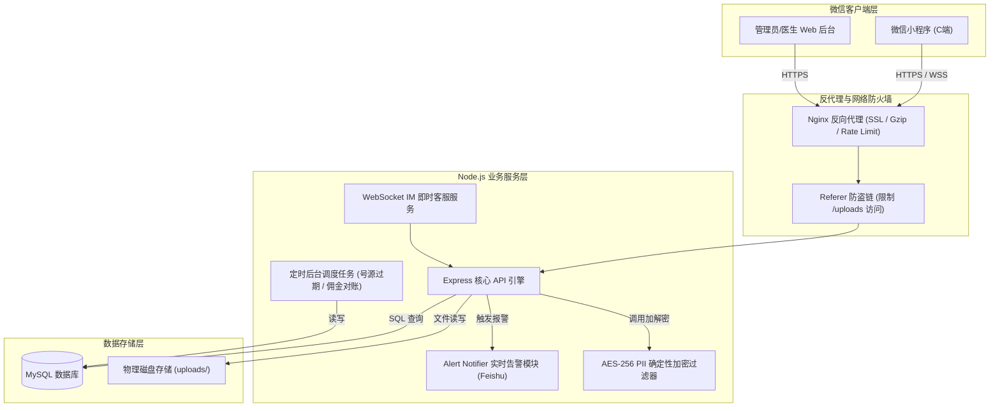

# 鼾静健康诊所 - 系统技术文档

本技术文档是“鼾静健康诊所”系统的底层设计与开发交付归档，涵盖：系统部署手册、核心接口说明、数据库结构设计、系统架构图以及微信生态第三方对接指引。

---

## 1. 部署手册 (Deployment Manual)

系统采用微服务架构设计，前端为微信原生小程序，后端为 Node.js (Express & WebSocket) 服务，数据库为 MySQL。

### 1.1 依赖环境要求
* **运行环境**：Node.js >= 18.0.0
* **数据库**：MySQL >= 8.0 或 MariaDB >= 10.5
* **进程管理**：PM2 >= 5.3.0
* **反向代理**：Nginx >= 1.20

### 1.2 后端部署步骤
1. **安装依赖**：
   进入 `hanjing-clinic-backend/` 目录执行依赖安装：
   ```bash
   npm install
   ```
2. **配置环境变量**：
   复制并重命名 `.env.example` 为 `.env`：
   ```env
   DB_HOST=127.0.0.1
   DB_PORT=3306
   DB_USER=root
   DB_PASSWORD=您的数据库密码
   DB_NAME=hanjing_clinic
   PORT=5005
   ALERT_WEBHOOK_URL=你的报警群机器人地址
   PII_ENCRYPTION_KEY=自定义32位敏感数据加密密钥
   ```
3. **执行初始化与启动**：
   * 测试环境热启动：`npm run dev`（支持 Nodemon 自动热重载）。
   * 生产环境 PM2 多核集群启动：
     ```bash
     pm2 start ecosystem.config.cjs --env production
     ```

### 1.3 前端小程序部署步骤
1. 下载微信开发者工具；
2. 导入 `mp-weixin/` 源码目录；
3. 修改 [mp-weixin/common/vendor.js](file:///Users/apple/Desktop/WorkSpace/hanjing/mp-weixin/common/vendor.js) 或全局配置文件中的 `baseURL` 为您的生产 API 域名；
4. 确认在微信公众平台后台已将 API 域名加入 `request合法域名` 白名单；
5. 在开发者工具中点击“上传”，并前往小程序后台提交审核发布。

---

## 2. 系统架构图 (Architecture Diagram)

以下是鼾静健康诊所系统的整体架构和边界隔离图：



---

## 3. 数据库设计 (Database Design)

系统对高频敏感字段在数据库层进行了防拖库加密处理。以下是核心物理表的设计 Schema。

### 3.1 核心表关系与索引说明
1. **`users` (用户主表)**
   * `id`: BIGINT (PK)
   * `openid`: VARCHAR(64) (UNIQUE INDEX, 微信身份标识)
   * `phone`: VARCHAR(128) (UNIQUE INDEX, 确定性加密密文)
   * `member_level`: VARCHAR(30) (会员等级)

2. **`patients` (就诊人档案表)**
   * `id`: BIGINT (PK)
   * `user_id`: BIGINT (FK, 关联users)
   * `name`: VARCHAR(100)
   * `phone`: VARCHAR(128) (INDEX: `idx_patients_phone`, 确定性加密密文)
   * `id_card`: VARCHAR(128) (INDEX: `idx_patients_id_card`, 确定性加密密文)
   * `relation`: VARCHAR(30) (本人/家人关系)

3. **`appointments` (挂号预约单表)**
   * `id`: BIGINT (PK)
   * `appointment_no`: VARCHAR(64) (UNIQUE INDEX, 挂号编号)
   * `user_id` / `patient_id` / `store_id` / `doctor_id` / `schedule_id` (均配置有外键索引)
   * `appointment_date`: DATE (INDEX: `idx_appt_date_status` 联合索引)
   * `status`: VARCHAR(30) (INDEX: `idx_appt_date_status` 联合索引)

4. **`audit_logs` (管理员审计表)**
   * `id`: BIGINT (PK)
   * `admin_id`: BIGINT (FK)
   * `action`: VARCHAR(100)
   * `ip_address`: VARCHAR(45) (审计 IP)
   * `details`: TEXT (记录变更 JSON payload)

---

## 4. 核心接口说明 (Core APIs)

详细接口设计详见项目下的 [db_and_api_design.md](file:///Users/apple/Desktop/WorkSpace/hanjing/db_and_api_design.md)。以下归纳最为核心的三个模块：

* **微信登录 (`POST /api/v1/user/login`)**：
  * **参数**：`{ code, phoneCode }`
  * **逻辑**：换取 OpenID；如果携带微信极速授权的手机号，会使用确定性加密算法 `encryptPII(phoneCode)` 后去比对用户表，实现自动跨端归集绑定并派发 JWT 令牌。
* **确认挂号支付 (`POST /api/v1/appointments/:id/confirm-pay`)**：
  * **逻辑**：采用事务悲观锁，防止重复提交及重叠通知。
* **文件上传 (`POST /api/v1/user/upload`)**：
  * **安全**：限制最大 `10MB`，后缀经过白名单与正则防目录穿越过滤。

---

## 5. 第三方对接说明 (Third-Party Integrations)

### 5.1 微信登录对接流程
1. 小程序端调用 `wx.login()` 获取临时登录凭证 `code`。
2. 小程序端通过 `getPhoneNumber` 按钮获取加密手机号凭证 `phoneCode`。
3. 后端将 `code` 发送至微信官方 API 换取 `session_key` 和 `openid`。
4. 解密 `phoneCode` 获取真实手机号，并以 `det:xxx` 密文映射至数据库用户。

### 5.2 微信支付（JSAPI）与回调对接说明
1. **预下单**：小程序端提交挂号，后端向微信支付统一下单接口（`https://api.mch.weixin.qq.com/v3/pay/transactions/jsapi`）发起请求，生成预支付交易单。
2. **签名回发**：后端对商户 ID、时间戳、随机串及预支付 ID 等数据使用**商户私钥**进行 RSA-SHA256 签名，生成支付签名包（`paySign`）返回小程序。
3. **支付回调**：微信服务器支付成功后，会以 POST 形式异步回调后端的 `/api/v1/appointments/pay-callback`。后端读取回调中的 `resource` 密文包，使用**微信支付 APIv3 密钥**执行解密，验签通过后触发就诊订单状态的事务性流转。
